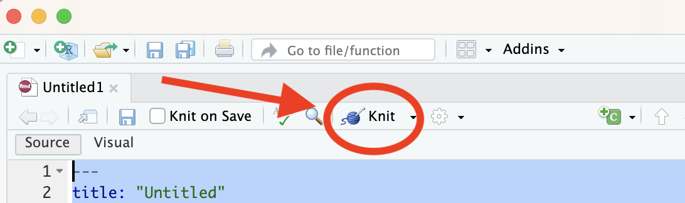

With RStudio, you can quickly produce high-quality PDF documents based on your R code.

Before you can do this you need to install two R packages with this code:

```{r}
install.packages('rmarkdown')

install.packages('tinytex')

tinytex::install_tinytex()
```

Once you have completed the installation, you can open any .Rmd file (like the files used for the weekly problem sets) you only need to use the "Knit" button in the RStudio.



### R Markdown: A very minimal guide

#### Markdown

A **[markdown]**(https://en.wikipedia.org/wiki/Markdown) document (.md) uses a simple, lightweight, syntax for rendering parts of the document (e.g. headings, lists, tables). Markdown is incredibly popular - it is used for example by Github and its 100 million users.

#### R Markdown

An **R Markdown** document (.Rmd) can include code chunks that run to produce some output (e.g. a figure) which will then be included in the rendered document.

#### Rendering

When you render a document, the rendering program will use your syntax to define how the final rendered document should look like. In this sense, a markdown (or an R Markdown) document should be considered as a source document to produce a document that can be easily distributed. The final rendered document can be an HTML document (so a webpage), a PDF, a PowerPoint or a Word document. For example,

.Rmd -> knit() -> .pdf

#### Parts of an R Markdown document

In an R Markdown document, you can find three parts:

1. **Header**. The header is optional and can define the title of the document, the author and the output format (`pdf_document`). Unsurprisingly, the header sits a the very top of the document. It can look like this:

```
---
title: "Untitled"
author: "Name Surname"
date: "21 July 1987"
output: pdf_document
---
```

2. **Markdown syntax** Most of the document uses markdown syntax. So the first paragraph of your document can look like this:

```
## R Markdown

This is an R Markdown document. Markdown is a simple formatting syntax for authoring HTML, PDF, and MS Word documents. For more details on using R Markdown see <http://rmarkdown.rstudio.com>.

When you click the **Knit** button a document will be generated that includes both content as well as the output of any embedded R code chunks within the document. You can embed an R code chunk like this:
```

Note for example `## R Markdown` indicating a header (H2) or `**Knit**`, which will be rendered as **Knit**. 

3. **Code snippets** Some part of the document will be dedicated to code chunks. In markdown, the syntax to define a a code chunk is this

```
```
a <- c(1,2,3)
b <- c(4,5,6)
```
```

If your document is an *R* Markdown document (.Rmd) instead of a simple markdown document (.md) your R code chunks will actually run (i.e. be *evaluated*) when you rend the document. An R code chunks will need to be defined like this:

```
```{r}
a <- c(1,2,3)
b <- c(4,5,6)
```
```

If you want to know more, begin [here](https://rmarkdown.rstudio.com/lesson-1.html).