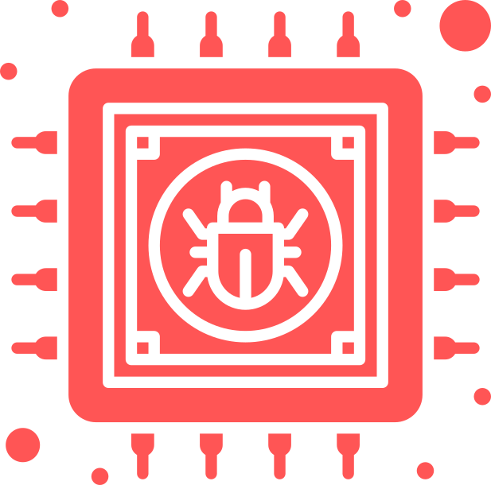
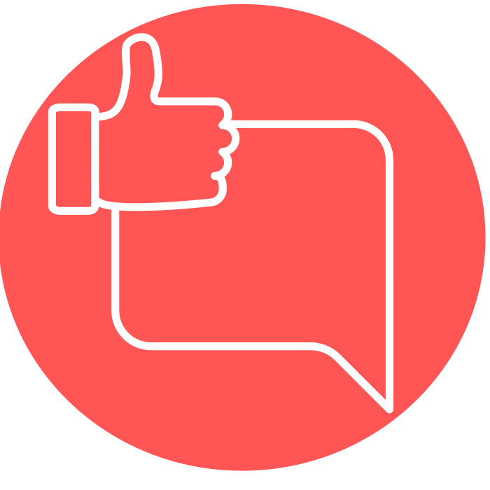
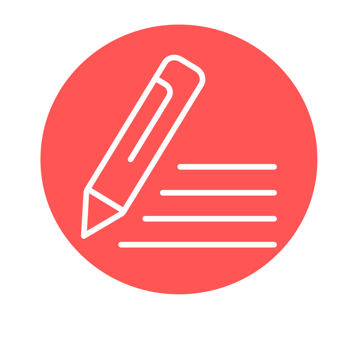
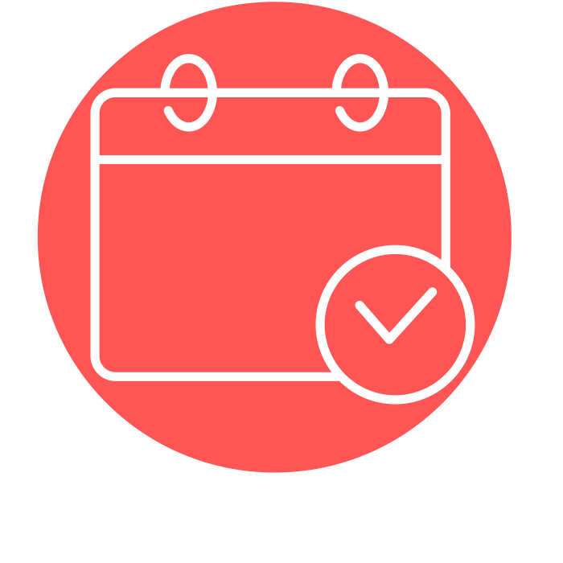
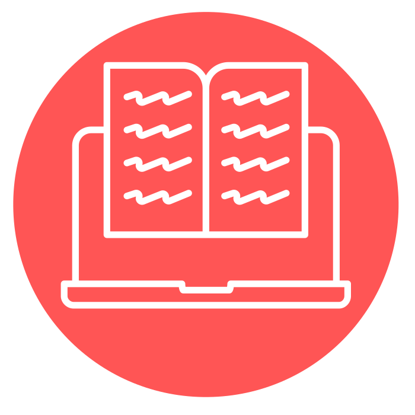
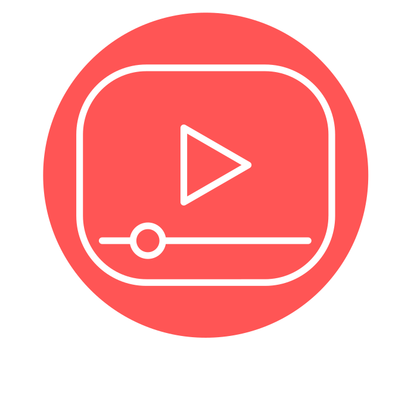

## Logo

## Welcome

Rubber Duck by alexa from <a href="https://thenounproject.com/browse/icons/term/rubber-duck/" target="_blank" title="Rubber Duck Icons">Noun Project</a>

## Modules

## MS Teams

thumbs by alexa from <a href="https://thenounproject.com/browse/icons/term/thumbs/" target="_blank" title="thumbs Icons">Noun Project</a>

## Assignments

Blog by alexa from <a href="https://thenounproject.com/browse/icons/term/blog/" target="_blank" title="Blog Icons">Noun Project</a>

## Syllabus

organizer by alexa from <a href="https://thenounproject.com/browse/icons/term/organizer/" target="_blank" title="organizer Icons">Noun Project</a>

## Readings

e-learning by alexa from <a href="https://thenounproject.com/browse/icons/term/e-learning/" target="_blank" title="e-learning Icons">Noun Project</a>

## Slides

## Video recordings

Video by alexa from <a href="https://thenounproject.com/browse/icons/term/video/" target="_blank" title="Video Icons">Noun Project</a>

## Graduation cap

bonnet by Alone forever from <a href="https://thenounproject.com/browse/icons/term/bonnet/" target="_blank" title="bonnet Icons">Noun Project</a>

