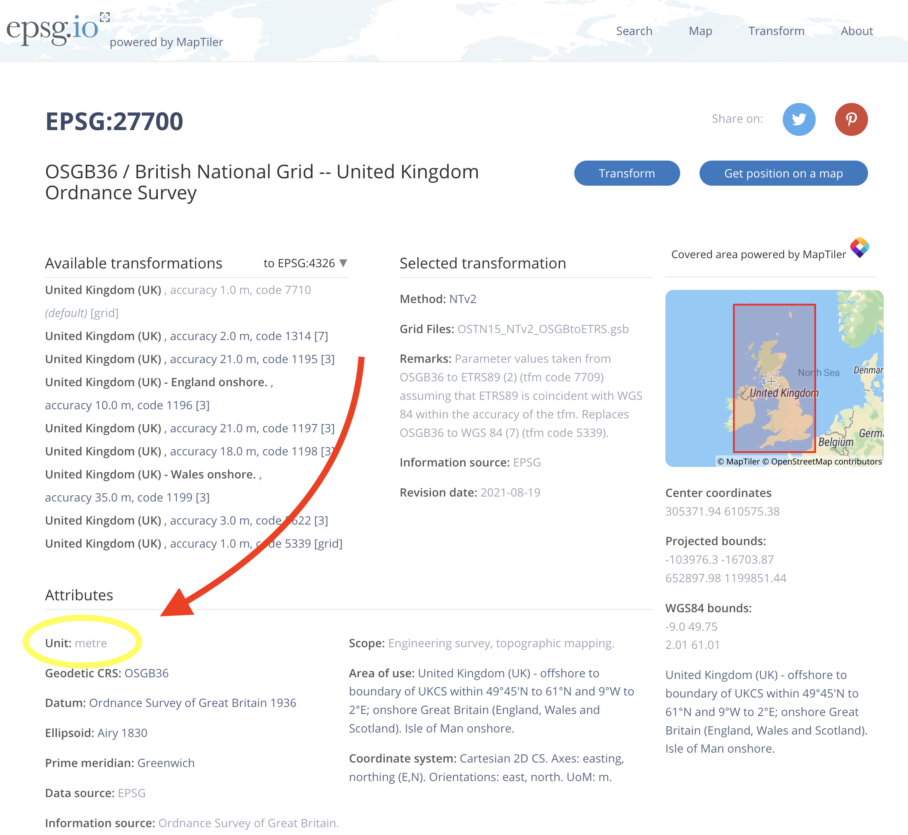

background-image: url(https://upload.wikimedia.org/wikipedia/en/6/6a/Logo_of_the_University_of_Sydney.svg)
background-size: 95%

```{r setup, include=FALSE}

options(htmltools.dir.version = FALSE)

knitr::opts_chunk$set(echo = TRUE, message = FALSE, warning = FALSE, 
                      dev = 'svg', out.width = "45%", fig.width = 6,
                      fig.align="center")

require(tidyverse)


```

---

# What is GIS

.pull-left[
> A geographic information system (GIS) is a **computer system** for 

* **capturing**, 
* **storing**, 
* **checking**, and 
* **displaying** 

> data related to positions on Earth’s surface. GIS can show many different kinds of data on one map, such as streets, buildings, and vegetation. This enables people to more easily see, analyze, and understand patterns and relationships. (Source: [National Geographic](https://education.nationalgeographic.org/resource/geographic-information-system-gis))
]

.pull-right[ 
*Source: U.S. Government Accountability Office*]

---

<video controls autoplay>
  <source src="https://www.tylermw.com/wp-content/uploads/2021/01/featureosm.mp4" type="video/mp4">
 </video>

*Source: [Tyler Morgan-Wall](https://www.tylermw.com/adding-open-street-map-data-to-rayshader-maps-in-r/)*

---
class: inverse, center, middle

# Spatial data 

---

## Vector and raster data

 
*Source: Marijan Grgic, University of Zagreb, Faculty of Geodesy.*

---

## Vector data vs raster data

* **Vector data** represent geographic information through vertices and paths between these vertices.

```{r echo = F, cache = T, fig.width = 12, out.width='100%'}

require(tidyverse)

require(sf)

require(osmdata)

building <- opq(bbox = c(151.186598,-33.886771,151.189758,-33.884753)) %>%
  add_osm_feature(key = 'building') %>%
  osmdata_sf()

leisure <- opq(bbox = c(151.186598,-33.886771,151.189758,-33.884753)) %>%
  add_osm_feature(key = 'leisure') %>%
  osmdata_sf()

highway <- opq(bbox = c(151.186598,-33.886771,151.189758,-33.884753)) %>%
  add_osm_feature(key = 'highway') %>%
  osmdata_sf()

grid.sf <- 
  st_make_grid(rbind(building$osm_polygons %>%
                       dplyr::select(osm_id),
                     leisure$osm_polygons %>%
                       dplyr::select(osm_id)), cellsize = .0001)

grid.sf <- 
  st_sf(id = 1, geometry = grid.sf)

res <- 
  st_intersects(grid.sf,
                     building$osm_polygons %>%
                       dplyr::select(osm_id))

grid.sf$intersect <- 
  lengths(res) > 0

  ggplot() +
    geom_sf(data = building$osm_polygons, fill = "orange", alpha = .4) +
    geom_sf(data = leisure$osm_polygons, fill = "green", alpha = .4) +
    geom_sf(data = highway$osm_lines, colour = "white", alpha = .4, linewidth = 2) +
    geom_sf(data = building$osm_points, colour = "orange") +
    geom_sf(data = leisure$osm_points, colour = "green") +
    geom_sf(data = highway$osm_points, colour = "white") +
    coord_sf(xlim = c(151.186598, 151.189758),
             ylim = c(-33.886771, -33.884753))

```

---

## Vector data vs raster data

* **Raster data** instead represent geographic information through a uniform grid (or a matrix). 

```{r, echo = F, fig.width = 12, out.width='100%'}
  ggplot() +
    geom_sf(data = grid.sf, aes(fill = intersect), alpha = .5) +
      geom_sf(data = leisure$osm_polygons, fill = NA) +
    coord_sf(xlim = c(151.186598, 151.189758),
             ylim = c(-33.886771, -33.884753)) +
  guides(fill = "none")
```

---

## Vector data vs raster data

```{r echo = F, out.width = "100%"}

require(leaflet)

leaflet::leaflet() %>% 
  leaflet::addPolygons(data = building$osm_polygons, group = "Buildings (vector polygons)", color = 'blue',) %>%
  leaflet::addCircleMarkers(data = building$osm_points, group = "Buildings (vector points)", color = 'orange', 
                   radius = 1, fillOpacity = 1, opacity = 1) %>%
  leaflet::addPolygons(data = grid.sf, group = "Buildings (raster)",
              opacity = 1, fillOpacity = 1, color = "black", fill = ~intersect, weight = 1) %>%
  leaflet::addProviderTiles(providers$Esri.WorldImagery) %>%
  leaflet::addLayersControl(
    overlayGroups = c("Buildings (vector points)", "Buildings (vector polygons)", "Buildings (raster)"),
    options = layersControlOptions(collapsed = FALSE)
  )

```

---

## Vector data vs raster data

* Common **vector point** data expressed by a pair of geographic coordinates (x & y or lon & lat): 

  * Cities, Events (e.g. protests), Addresses, Poll stations, ...
  
* Common **vector lines** data expressed by 2+ pairs of geographic coordinates:

  * Street, Rivers, ...
  
* Common **vector polygons** data expressed by 3+ pairs of geographic coordinates:

  * Administrative areas (e.g. countries, states, municipalities), Electoral areas, ...
  
* Common **raster** data expressed by a grid (matrix) of equally-sized cells:

  * Elevation, Population density, Vegetation index, ...
  
---

## Coordinate reference system (CRS)

CRS allows to translate a position everywhere on the surface of the Earth into a set of coordinates. 

.center[]

If you open your phone you are probably able to quickly find an app that lets you know where you are on the surface of the Earth. That information will be delivered using a set of coordinates expressed as latitude and longitude. That particular CRS is named *GCS WGS 84*.  But the same position could be expressed using a different CRS. 

If you know the CRS of your data you can easily transform it into a different CRS.

---

## Transforming your coordinates

Assuming you know your 

* coordinates;
* origin CRS; and 
* target CRS,

You can easily do this with https://epsg.io/transform (or with R, more on this later).


<iframe src = "https://epsg.io/transform#s_srs=4326&t_srs=26717&x=151.1853860&y=-33.8853150"  width="100%" height="300"/>

---

## Coordinate reference system (CRS)

A CRS definition comes with a number of specifications. These are the specifications you want to know for the CRS you are working with:

| EPSG Code | Name                                   | CS Type                | Projection                                                                         | Unit of Measure |
|-----------|----------------------------------------|------------------------|------------------------------------------------------------------------------------|-----------------|
| 4326      | GCS WGS 84                             | ellipsoidal (lat, lon) | Not projected                                                                             | degree of arc   |
| 26717     | UTM Zone 17N NAD 27                    | cartesian (x,y)        | Transverse Mercator: central meridian 81°W, scaled 0.9996                          | meter           |
| 6576      | SPCS Tennessee Zone NAD 83 (2011) ftUS | cartesian (x,y)        | Lambert Conformal Conic: center 86°W, 34°20'N, standard parallels 35°15'N, 36°25'N | US survey foot  |

---

## Projection

No matter what you might have heard, the Earth is **spherical**. Yet often we want our maps to be **planar** (i.e. flat).

> What are projections?

> Projections are a mathematical transformation that take spherical coordinates (latitude and longitude) and transform them to an XY (planar) coordinate system. This enables you to create a map that accurately shows distances, areas, or directions. With this information, you can accurately work with the data to calculate areas and distances and measure directions. As implemented in Geographic Information Systems, projections are transformations from spherical coordinates to XY coordinates systems and transformations from one XY coordinate system to another. (Source: [MIT](http://web.mit.edu/1.961/fall2001/projections.htm#:~:text=What%20are%20projections%3F,distances%2C%20areas%2C%20or%20directions.))

---

## Transformation, projection and reprojection

It sounds complicated! `r emo::ji("worried")` Why do we care? 

There are two main reasons to care about the CRS of your data. 

1. You want to map data expressed with different CRSs *together*.

  * **Action**: You will need to transform your data so that your spatial features share the same CRS.
  
2. You want to measure your data (e.g. in meters)

  * **Action**: You will need to (re)project your data, so that the unit of the CRS is the meter but also making sure that the CRS you pick is suitable for the area you want to measure.
  
---

## Choosing the right CRS

You can search the area you are interested in with https://epsg.io and see what CRSs cover that area.

<iframe src = 'https://epsg.io/?q=New+South+Wales' width="100%" height="400"/>

---

## GIS software

Among the most popular desktop GIS applications are

* **ArcGIS** (from ESRI): This is likely the most commonly used GIS by professionals. It is proprietary and not cheap.

* **QGIS**: This is the most popular open source desktop GIS. It has a large community of developers and users.

Among the most popular spatial database management systems is

* **PostGIS** (An open source extensions for the also open source PostgreSQL). You need it if you are planning computationally intensive geographic analysis.

Although you can do all your geographic analysis and mapping in R, it is sometimes handy to open your data in a desktop app such as QGIS. 

A GIS desktop application is essential if you plan to create or edit geographic data. 


---
class: inverse, center, middle

# Lab

## Spatial data and analysis in R

---

## Simple Features

> **Simple Features** ... is a set of standards that specify a common storage and access model of geographic feature. (Source: [Wikipedia](https://en.wikipedia.org/wiki/Simple_Features)).

### The sf package for R

.pull-left[

.center[]

.center[https://r-spatial.github.io/sf/]

]

.pull-right[

* Represents simple features as records in a `data.frame` with a geometry list-column.
* Extensive access to functions for *confirmation* (e.g. `st_contains`), *operations* (e.g. `st_buffer`) and creation (e.g. `st_point`).
* Excellent integration with **ggplot2** using `geom_sf()`...
* Excellent integration with **Leaflet** to produce online interactive maps...

]

---

## The sf integration with ggplot: geom_sf()

Once you have the data in the right sf format (e.g. `nc` below), producing some visualisation is as easy as ...

```{r echo = F}
require(ggplot2)

require(sf)

nc <- sf::st_read(system.file("shape/nc.shp", package = "sf"), quiet = TRUE)
```


```{r out.width="100%", fig.height=3, fig.width=10}

ggplot(nc) +
  geom_sf(aes(fill = AREA))

```

---

## John Snow and the 1854 London's cholera outbreak

.center[]

.center[(Not this Jon Snow)]

---

## John Snow and the 1854 London's cholera outbreak

.center[]

*Original map made by John Snow in 1854. Source: [Wikipedia](https://commons.wikimedia.org/wiki/File:Snow-cholera-map-1.jpg)*

---

## Load data

Data files are in [this folder](https://github.com/fraba/SSPS4102/tree/master/data/SnowGIS). To download the entire folder as a compressed archived [click here](https://minhaskamal.github.io/DownGit/#/home?url=https://github.com/fraba/SSPS4102/tree/master/data/SnowGIS).

```{r}

# Load the required packages

require(tidyverse)

require(sf)

require(leaflet)

# Path might be different on your computer! #<<

Cholera_Deaths <- 
  sf::read_sf("../data/SnowGIS/Cholera_Deaths.shp")

# Same here #<<

Pumps <- 
  sf::read_sf("../data/SnowGIS/Pumps.shp")

```

`sf::read_sf()` can read many different file formats. Here we are reading two [shapefiles](https://en.wikipedia.org/wiki/Shapefile).

---

Let's check the class of these two simple features (sf) spatial objects...

```{r}

class(Cholera_Deaths)

class(Pumps)

```

---


```{r eval = F, tidy=FALSE}

head(Cholera_Deaths)

## Simple feature collection with 6 features and 2 fields #<<
## Geometry type: POINT #<<
## Dimension:     XY
## Bounding box:  xmin: 529308.7 ymin: 181006 xmax: 529336.7 ymax: 181031.4
## Projected CRS: OSGB36 / British National Grid
## # A tibble: 6 × 3
##      Id Count            geometry #<<
##   <int> <int>         <POINT [m]>
## 1     0     3 (529308.7 181031.4)
## 2     0     2 (529312.2 181025.2)
## 3     0     1 (529314.4 181020.3)
## 4     0     1 (529317.4 181014.3)
## 5     0     4 (529320.7 181007.9)
## 6     0     2   (529336.7 181006)
```


The simple feature (sf) object contains 6 features of type `POINT` with 2 data fields (`ID` and `Count`). 

Records can have multiple fields since they are geometric/geographic features combined with a `data.frame`.

---

```{r eval = F, tidy=FALSE}

head(Cholera_Deaths)

## Simple feature collection with 6 features and 2 fields 
## Geometry type: POINT
## Dimension:     XY
## Bounding box:  xmin: 529308.7 ymin: 181006 xmax: 529336.7 ymax: 181031.4 
## Projected CRS: OSGB36 / British National Grid #<<
## # A tibble: 6 × 3
##      Id Count            geometry
##   <int> <int>         <POINT [m]>
## 1     0     3 (529308.7 181031.4)
## 2     0     2 (529312.2 181025.2)
## 3     0     1 (529314.4 181020.3)
## 4     0     1 (529317.4 181014.3)
## 5     0     4 (529320.7 181007.9)
## 6     0     2   (529336.7 181006)

```

Also important to notice is the CRS. 98% of the times if something doesn't work or look right with your spatial analysis/mapping is an issue with the coordinate systems. 

In this case the data (being about London) is projected using the CRS [OSGB36](https://epsg.io/27700) - which corresponds to the code 27700 in [EPSG registry](https://epsg.org/home.html). The EPSG code of your data is useful to know if you need to change the projection of your features with `sf::st_transform()`.  

---

You can quickly interactively visualise your data with [Leaflet for R](https://rstudio.github.io/leaflet/).

```{r, out.width = "100%", out.height = "400px"}

leaflet::leaflet(Cholera_Deaths %>%
                   sf::st_transform(4326)) %>%
  leaflet::addTiles() %>%
  leaflet::addCircles(radius = ~sqrt(Count) * 5)

```

---

Note, the transformation to [EPSG:4326](https://epsg.io/4326) which is the unprojected CRS used by GPS, which is therefore used by most web mapping application like **Google Maps** or **OpenStreetMap** (which we are using here...)

```{r eval = F}

leaflet::leaflet(Cholera_Deaths %>%
                   sf::st_transform(4326)) %>% #<<
  leaflet::addTiles() %>%
  leaflet::addCircles(radius = ~sqrt(Count) * 5)

```


---

`leaflet::addTiles()` add a background tile. By default it will use an OSM tile (this is why you need to transform your features to EPSG:4326). 

```{r eval = F}

leaflet::leaflet(Cholera_Deaths %>%
                   sf::st_transform(4326)) %>% 
  leaflet::addTiles() %>% #<<
  leaflet::addCircles(radius = ~sqrt(Count) * 5)

```

But there is a long list of different third-party tiles you can use for your maps (free of charge). A complete list is available [here](http://leaflet-extras.github.io/leaflet-providers/preview/index.html). 

For example replacing `addTiles()` with `addProviderTiles(providers$CartoDB.PositronNoLabels)` will produce 

```{r echo = F, out.width = "100%", out.height = "200px"}

leaflet::leaflet(Cholera_Deaths %>%
                   sf::st_transform(4326)) %>% 
  leaflet::addProviderTiles(providers$CartoDB.PositronNoLabels) %>%
  leaflet::addCircles(radius = ~sqrt(Count) * 5)

```

---

With `leaflet::addCircles()`, we add circles to the map. The features we are mapping are of course the features contained in the sf `Cholera_Deaths`. 

Specifically, `leaflet::leaflet(data)`, will create our map and the pipe `%>%` will pass it down to the other functions, so that we can progressively (back-to-top) add new layers and new data. 

With  `radius` we specify the radius of the circles. Here, we are mapping the value from the column `Count` contained in the `data.frame` of `Cholera_Deaths` (this is similar to what happens in ggplot2's `aes()`).

```{r eval = F}

leaflet::leaflet(Cholera_Deaths %>%
                   sf::st_transform(4326)) %>% 
  leaflet::addTiles() %>%
  leaflet::addCircles(radius = ~sqrt(Count) * 5)  #<<

```

---

Let's now add the pumps features. In this situation, I simply add a layer with `addMarkers()`. This of course is very much like how we add layers in ggplot2 `r emo::ji("smile")`. 

```{r out.width = "100%", out.height = "300px"}

leaflet::leaflet(Cholera_Deaths %>%
                   sf::st_transform(4326)) %>% 
  addProviderTiles(providers$Stamen.TonerLite) %>%
  leaflet::addCircles(radius = ~sqrt(Count) * 5) %>%
  leaflet::addMarkers(data = Pumps %>%
                   sf::st_transform(4326))

```

---

Let's leave Leaflet now, and let's do some **spatial analysis**!

.center[]

---

## Visualising sf with ggplot2 and geom_sf()

Visualising your features is relatively simple using ggplot2. As simple as...

```{r}

ggplot() +
  geom_sf(data = Cholera_Deaths, colour = 'blue') +
  geom_sf(data = Pumps, colour = 'orange')

```

---

## Visualising sf with ggplot2 and geom_sf()

`geom_sf()` will draw different geometric objects - points, lines, or polygons - depending on the type of your sf. You can use `coord_sf()` for zooming in into your map. 

```{r, eval = F}

ggplot() +
  geom_sf(data = Cholera_Deaths, colour = 'blue') +
  geom_sf(data = Pumps, colour = 'orange') +
  coord_sf(xlim = c(529209.9, 529606.3), 
           ylim = c(180902.7, 181261.4))

```

.pull-left[

```{r echo = F, out.width = "55%", fig.width = 5, fig.height = 5}

ggplot() +
  geom_sf(data = Cholera_Deaths, colour = 'blue') +
  geom_sf(data = Pumps, colour = 'orange') +
  geom_sf(data =  st_as_sfc(list(st_polygon(list(rbind(c(529209.9, 180902.7),
                                       c(529606.3, 180902.7),
                                       c(529606.3, 181261.4),
                                       c(529209.9, 181261.4),
                                       c(529209.9, 180902.7))))),
                      crs = 27700),
          alpha = .25, fill = 'gray') #<<

```

]

.pull.right[

```{r, echo = F, out.width = "30%", fig.width = 5, fig.height = 5}

ggplot() +
  geom_sf(data = Cholera_Deaths, colour = 'blue') +
  geom_sf(data = Pumps, colour = 'orange') +
  coord_sf(xlim = c(529209.9, 529606.3), ylim = c(180902.7, 181261.4))

```

]

Visualising a simple map is straightforward, making it exactly as you want of course requires time!  

---

## Computing cases within distance from each pump 

A simple visual analysis of the maps we have created so far is probably sufficient for suspecting a connection between cholera deaths and the water pump in Broadwick Street (formerly Broad Street). But let's say we want to somehow formalise this by calculating the number of deaths within a 150 meter radius from each pump. 

This is what we need to do:

1. Create an circular area centered on each pump;

2. Intersect cases (point) with areas (polygons);

3. Count how many deaths within each area. 

---

### Creating an circular area with a radius of 150 m centered on each pump

```{r fig.height=5, fig.width=5, out.width="42%"}

Pumps.buffer <- 
  Pumps %>%
  sf::st_buffer(150) #<<

ggplot() +
  geom_sf(data = Cholera_Deaths, colour = 'blue') +
  geom_sf(data = Pumps, colour = 'orange') +
  geom_sf(data = Pumps.buffer, colour = 'orange', alpha = .5)

```

---

### Creating an circular area with a radius of 150 m centered on each pump

We are lucky that the unit of the CRS of `Pumps` (OSGB36 or EPSG:27700) is the meter. Other CRS have different units. For example, the unit of EPSG:4326 is the degree - so calculating distances or areas in meters requires a transformation.   

.pull-left[

How do we guess the unit for a CRS? 

Don't guess! Instead, visit https://epsg.io/ and search for your CRS (or simply google your CRS).

]

.pull-right[.center[]]

---

### Counting how many deaths within each area

Let's create a `matrix` with one row for each record in `Cholera_Deaths` and one column for each pump. 

```{r}

m <- 
  matrix(nrow = nrow(Cholera_Deaths), ncol = nrow(Pumps.buffer))

dim(m)

head(m)

```

---

#### Intersecting points with polygons

Then in a for-loop, we geographically intersect (`st_intersect`) each point (`Cholera_Deaths`) with a pump's area (from `Pumps.buffer`), one at a time...

```{r}

for (j in 1:nrow(Pumps.buffer)) {
  
  m[,j] <- 
    lengths(
      sf::st_intersects(x = Cholera_Deaths, 
                        y = Pumps.buffer[j,]) #<<
    ) > 0
  
}

```

`st_intersects()` returns a list where for each feature in `x` (points, lines or polygons), indicates the indices of the intersecting `y` features. 

But our `y` contains only a single feature (with `Pumps.buffer[j,]` we are considering a single pump for each iteration of the for-loop). So, the length of the vector containing the indices of the intersecting feature is `0` if `x` & `y` do not intersect while `>0` (i.e. `1`) if `x` & `y` intersect. 

---

#### Intersecting points with polygons

This is what our `matrix` `m` now looks like, with all the results...

```{r}

head(m)

```


Note that by design a single record from `Cholera_Deaths` can intersect with more than one pump. But this is of course clear in the previous visualisations: our buffers do partially overlap.

---

#### Intersecting points with polygons

Let's now visualise which records intersect with each pump.

First, we want to create a base map (i.e. `base_map`) visualising all the records in the data set. 

```{r}

base_map <-
  ggplot()  +
  geom_sf(data = Pumps.buffer, 
          colour = 'lightgray', alpha = .2) +
  geom_sf(data = Cholera_Deaths,
          colour = 'lightgray')

```

Conveniently, `base_map` can be add as first layer to other spational visualisations.


---

```{r out.width = "100%", fig.width = 7, fig.height = 4}

base_map

```

---

#### Intersecting points with polygons

And now we add to `base_map` the records (with `Cholera_Deaths[m[,1],]`) intersecting with the first pump (`Pumps.buffer[1,]`) and with the second (`Pumps.buffer[2,]`).

```{r eval = F}

base_map +
  geom_sf(data = Cholera_Deaths[m[,1],], 
          colour = 'blue') +
  geom_sf(data = Pumps.buffer[1,], 
          colour = 'orange', alpha = .5),

```

```{r echo = F, out.width = "100%", fig.width = 12, fig.height = 5}

cowplot::plot_grid(

base_map +
  geom_sf(data = Cholera_Deaths[m[,1],], 
          colour = 'blue') +
  geom_sf(data = Pumps.buffer[1,], 
          colour = 'orange', alpha = .5),

base_map +
  geom_sf(data = Cholera_Deaths[m[,2],], 
          colour = 'blue') +
  geom_sf(data = Pumps.buffer[2,], 
          colour = 'orange', alpha = .5),

labels = c("Pumps.buffer[1,]", "Pumps.buffer[2,]")

)

```

---

## Counting how many deaths within each area

Now that we have all the results, we can associate the number of deaths to each pump.

Let's first create a new variable `Count` where to store that information (while initially setting the `Count` to `NA`).

```{r}

Pumps$Count <- NA

```

Then we can again loop over each pump and make the sum of cases, 

```{r}

for (i in 1:nrow(Pumps)) {
  
  Pumps$Count[i] <-
    sum(Cholera_Deaths$Count[m[,i]]) #<<
  
}
  
```

and finally compute the percentage of all cases reported.

```{r}
Pumps$perc <- Pumps$Count / sum(Cholera_Deaths$Count) #<<
```

---

## Counting how many deaths within each area

```{r echo = F}

require(knitr)

Pumps %>%
  kable()
  
```

We can now conclude that **68.5%** of all cases reported were located within 150 meters of a single pump. 

---

## Counting how many deaths within each area

```{r out.width = "100%", out.height = "350px"}

leaflet(Pumps %>%
                   sf::st_transform(4326)) %>% 
  addProviderTiles(providers$Stamen.TonerLite) %>%
  addMarkers() %>%
  addCircles(radius = ~sqrt(perc) * 200)

```


---

.center[]


---

class: inverse, center, middle

# Bonus
## Getting (ready-to-use) spatial data from OpenStreetMap with R

---

.pull-left[
## OpenStreetMap
]

.pull-right[.center[
]
]

.center[<iframe src = "https://tyrasd.github.io/osm-node-density/#2/26.7/27.2/latest" width="100%" height="400"></iframe>]

*Source: OSM node density by [Martin Raifer](https://tyrasd.github.io/osm-node-density)*

---

## Getting (ready-to-use) spatial data from OpenStreetMap with R

OpenStreetMap provides spatial data to add context to your visualisations. Of course, it can also offer data to your analysis!

The R package osmdata offers a number of functions to quickly 

* Query the OSM database for the features you need;
* Download the features your need; and
* Load them directly into your R session.

.center[]

---

## Querying the OSM database for features

```{r cache = T}
require(tidyverse)

require(sf)

require(osmdata)

my_osmdata.sf <- 
  osmdata::opq(bbox = c(13.300407,45.899290,13.318432,45.913535)) %>% #<<
  osmdata::add_osm_feature(key = 'building') %>%
  osmdata::osmdata_sf()
```

The `opq()` function builds a query for the OpenStreetMap API. The argument we use here is `bbox`, which set the bounding box for the query. With `bbox`, we can either use the extension of the box (`c(xmin, ymin, xmax, ymax)`) or we can try a string query ("Greater Sydney"). 

In general, it is probably better to control our query by manually setting the bounding box. 

Also, if the bounding box is too wide you might hit a limit (either and API limit or with your memory!)

---

## Querying the OSM database for features

Use http://bboxfinder.com/ to find the coordinates for your bounding box (`bbox`)!

.center[<iframe src = "http://bboxfinder.com/" width="100%" height="400"></iframe> ]

---

## Querying the OSM database for features

```{r eval = F}
my_osmdata.sf <- 
  osmdata::opq(bbox = c(13.300407,45.899290,13.318432,45.913535)) %>% 
  osmdata::add_osm_feature(key = 'building') %>% #<<
  osmdata::osmdata_sf()
```

Once, we have set boundary for the query we can specify one type of feature we want to pull from OSM. 

---

## Specifying the features

The list of possible features (see https://wiki.openstreetmap.org/wiki/Map_features) is pretty extensive. Features in OSM are defined in terms of Key - Value combinations. 

.center[<iframe src = "https://wiki.openstreetmap.org/wiki/Map_features" width="100%" height="200"></iframe>]

With `add_osm_feature()` we can either mention only the `key` or both the `key` and the `value` if we want to be more specific.

```{r eval = F}
  osmdata::add_osm_feature(key = 'building', 
                           value = 'synagogue') %>% #<<
```

---

## Transforming the features into sf objects

```{r eval = F}
my_osmdata.sf <- 
  osmdata::opq(bbox = c(13.300407,45.899290,13.318432,45.913535)) %>% 
  osmdata::add_osm_feature(key = 'building') %>%
  osmdata::osmdata_sf() #<<
```

The function `osmdata_sf()` transforms the OSM data into and `sf`-ready object. Let's have a look into `my_osmdata.sf`:

```
Object of class 'osmdata' with:
                 $bbox : 45.89929,13.300407,45.913535,13.318432
        $overpass_call : The call submitted to the overpass API
                 $meta : metadata including timestamp and version numbers
           $osm_points : 'sf' Simple Features Collection with 5966 points
            $osm_lines : 'sf' Simple Features Collection with 2 linestrings
         $osm_polygons : 'sf' Simple Features Collection with 668 polygons
       $osm_multilines : NULL
    $osm_multipolygons : 'sf' Simple Features Collection with 19 multipolygons
```

---

## Transforming the features into sf objects

We see that a number of different sf *collections* have been returned. We have points, lines, polygons and multipolygons (wait, [what's a multipolygon](https://gis.stackexchange.com/a/225396)?)

```
           $osm_points : 'sf' Simple Features Collection with 5966 points
            $osm_lines : 'sf' Simple Features Collection with 2 linestrings
         $osm_polygons : 'sf' Simple Features Collection with 668 polygons
       $osm_multilines : NULL
    $osm_multipolygons : 'sf' Simple Features Collection with 19 multipolygons
```

---

## Transforming the features into sf objects

And if we look into `$osm_polygons`, we get this... 

```{r}

my_osmdata.sf$osm_polygons

```


---

## Visualising the OSM data with geom_sf()

Once we have our OSM features in memory, we can finally visualise them with ggplot!

```{r eval=F}
ggplot() +
  geom_sf(data = my_osmdata.sf$osm_polygons, fill = "orange") +
  geom_sf(data = my_osmdata.sf$osm_multipolygons, fill = "blue") +
  coord_sf(xlim = c(13.300407,13.318432),
           ylim = c(45.899290,45.913535))
```


---

```{r echo = F, fig.width = 10, out.width = "90%"}
ggplot() +
  geom_sf(data = my_osmdata.sf$osm_polygons, fill = "orange") +
  geom_sf(data = my_osmdata.sf$osm_multipolygons, fill = "blue") +
  coord_sf(xlim = c(13.300407,13.318432),
           ylim = c(45.899290,45.913535))
```


