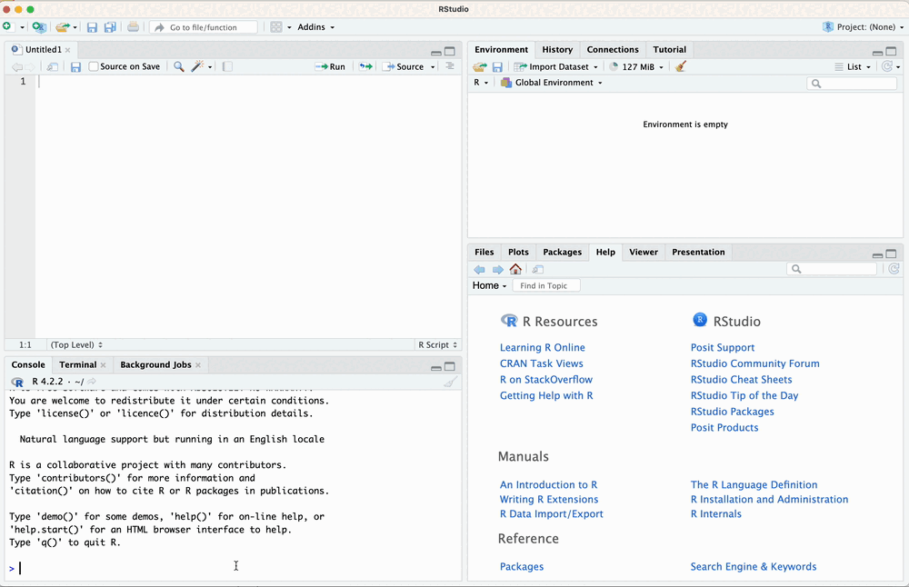

background-image: url(https://upload.wikimedia.org/wikipedia/en/6/6a/Logo_of_the_University_of_Sydney.svg)
background-size: 95%

```{r setup, include=FALSE}

options(htmltools.dir.version = FALSE)

knitr::opts_chunk$set(echo = TRUE, message = FALSE, warning = FALSE, 
                      dev = 'svg', out.width = "45%", fig.width = 6,
                      fig.align="center")

library(tidyverse)
library(sf)
library(DiagrammeR)

```

---

## Acknowledgement of Country

I would like to acknowledge the Traditional Owners of Australia and  recognise their continuing connection to land, water and culture. The  University of Sydney is located on the land of the Gadigal people  of the Eora Nation. I pay my respects to their Elders, past and present.

---

## Your teacher
	
Francesco Bailo (francesco.bailo@sydney.edu.au)

I am a Lecturer in the School of Social and Political Sciences, University of Sydney. I am interested in researching forms of political engagement and political talk on social media. I researched the emergence and dynamics of online communities, the role between news organisations and social media, and the interdependence between social media activists and news organisations. I have engaged with and applied quantitative research methods developing expertise in quantitative text analysis (NLP) and network analysis.

This year I am teaching GOVT6139 and SSPS4102.

---

## Today's class

* Unit's introduction and overview

    * Textbook and texts
  
    * Content
    
    * Learning goals
    
    * How to do this
  
* Lab: Get started with R and RStudio

* Individual quiz

* Group problem set


---
class: inverse, center, middle

# Get started with SSPS4102

---

# What you need to take this unit (1/2)

* No prior knowledge of statistics

--

* No coding experience

--

* Minimal maths background

--

* Install 
  * `r emo::ji("backhand index pointing right")` https://rstudio-education.github.io/hopr/starting.html

--

* Install  
  * also `r emo::ji("backhand index pointing right")` https://rstudio-education.github.io/hopr/starting.html

--

* Bring your laptop to class

---

# What you need to take this unit  (2/2)

*  **Every week**: 

    * do the readings, 
    
    * complete any [to-do (check "Syllabus" in Canvas)](https://canvas.sydney.edu.au/courses/49127/assignments/syllabus),
    
    * come to class, 
    
    * engage with the in-class tasks.

---

# Some tips


* Ask questions sooner than later.

--

* All seminar slides are available from Canvas before class:

  * Keep them open on your laptop in class to 

      * copy/paste code in RStudio; and

      * follow links.

---

## Textbook

Llaudet, E., & Imai, K. (2022). _Data analysis for social science: A friendly and practical introduction_. Princeton University Press. https://press.princeton.edu/books/hardcover/9780691199429/data-analysis-for-social-science (DASS) 

.pull-left[
* Publicly and fully available online: NO
* Online access through library: NO
* Copy available through library: YES [link](https://sydney.primo.exlibrisgroup.com/permalink/61USYD_INST/1c0ug48/alma991032428525605106)

This book is highly accessible and will introduce you to both R and important concepts for data analysis. 

Suggestion: Get your own copy (PDF and Kindle version are available)
]

.pull-right[
.center[]
]

  
---

## Other texts (1/4)

* boyd,  danah, & Crawford, K. (2012). Critical questions for big data. _Information, Communication & Society_, 15(5), 662–679. https://doi.org/10.1080/1369118X.2012.678878
  * Publicly and fully available online: NO
  * Online access through library: YES [link](https://sydney.primo.exlibrisgroup.com/permalink/61USYD_INST/2rsddf/cdi_proquest_miscellaneous_1315867033)

* Cairo, A. (2012). _The Functional Art: An introduction to information graphics and visualization_. New Riders. https://learning.oreilly.com/library/view/the-functional-art/9780133041187/ (FA)
  * Publicly and fully available online: NO
  * Library access: YES [link](https://sydney.primo.exlibrisgroup.com/permalink/61USYD_INST/1c0ug48/alma991031515966205106)
    * Online access: YES [link](https://learning.oreilly.com/library/view/the-functional-art/9780133041187/)
    * Hard Copy: YES
  
---

## Other texts (2/4)

* Cairo, A. (2016). _The Truthful Art: Data, Charts, and Maps for Communication_. Pearson Education. https://learning.oreilly.com/library/view/the-truthful-art/9780133440492 (TA)
  * Publicly and fully available online: NO
  * Library access: YES [link](https://sydney.primo.exlibrisgroup.com/permalink/61USYD_INST/1c0ug48/alma991031515966205106)
    * Online access: YES [link](https://learning.oreilly.com/library/view/the-truthful-art/9780133440492/)
    * Hard Copy: NO
    
* Floridi, L. (2012). Big data and their epistemological challenge. Philosophy & Technology, 25(4), 435–437. https://doi.org/10.1007/s13347-012-0093-4
  * Publicly and fully available online: YES [link](https://doi.org/10.1007/s13347-012-0093-4)

* Grolemund, G. (2014). _Hands-on programming with R_. O'Reilly. https://rstudio-education.github.io/hopr/ (HOPR)
  * Publicly and fully available online: YES [link](https://rstudio-education.github.io/hopr/)


---

## Other texts (3/4)

* James, G., Witten, D., Hastie, T., & Tibshirani, R. (2021). _An introduction to statistical learning: With applications in R_. Springer. https://www.statlearning.com/ (I2SL)
  * Publicly and fully available online: YES [link](https://link.springer.com/book/10.1007/978-1-0716-1418-1)
  
* Kitchin, R. (2014). Big Data, new epistemologies and paradigm shifts. _Big Data & Society_, 1(1). https://doi.org/10.1177/2053951714528481
  * Publicly and fully available online: YES [link](https://doi.org/10.1177/2053951714528481)

* Imai, K. (2017). _Quantitative social science: An introduction_. Princeton University Press. https://press.princeton.edu/books/paperback/9780691175461/quantitative-social-science (QSS)
  * Publicly and fully available online: NO
  * Library access: NO

---

## Other texts (4/4)

* Silge, J., & Robinson, D. (2017). _Text mining with R: A tidy approach_. O’Reilly. https://www.tidytextmining.com/ (TMWR)
  * Publicly and fully available online: YES [link](https://www.tidytextmining.com/)
  
* Xie, Y., Allaire, J. J., & Grolemund, G. (2019). _R Markdown: The definitive guide_. CRC Press. https://bookdown.org/yihui/rmarkdown/ (RMD)
  * Publicly and fully available online: YES [link](https://bookdown.org/yihui/rmarkdown/)

* Wickham, H., & Grolemund, G. (2017). _R for data science_. O'Reilly. https://r4ds.had.co.nz/ (R4DS)
  * Publicly and fully available online: YES [link](https://r4ds.had.co.nz/)

* Wattenberg, M., Viégas, F., & Johnson, I. (2016). How to use t-SNE effectively. Distill, 1(10), e2. https://doi.org/10.23915/distill.00002
  * Publicly and fully available online: YES [link](https://doi.org/10.23915/distill.00002)

---

class: inverse, center, middle

# Content

---

# Content

This unit will introduce you (gently!) to 

1. computer programming with R, a language for [statistical computing](https://en.wikipedia.org/wiki/Computational_statistics).

2. concepts for data analysis and its practice using R.

## Learning goal in a nutshell

To analyse data to

1. Measure;

2. Explain; 

3. Predict.

---

# How to learn data analysis + coding (1/2)

* The challenge in this unit is that on top of learning data analysis concepts, you also need to learn to code with R... 

* but this is an opportunity:<sup>1</sup> data analysis concepts are always and immediately applied to data using R.

.center[]

.footnote[
[1] Of course, it is! This is very much a *feature* of the unit, not a *bug*!
]

---

# How to learn data analysis + coding (2/2)

Focus on

1. understanding (and communicating your understanding) of all the data analysis concepts;

2. understanding how to apply these concepts to your data with R;

3. developing a *functional* understanding of R - don' try to understand everything R does (or does not) for you! 

<center>

```{r, echo = F}

DiagrammeR::grViz("digraph {
  graph [layout = dot, rankdir = LR] 
  
  node [shape = oval]        
  nod1 [label = 'Deep\\nunderstanding']
  nod2 [label = 'Functional\\nunderstanding']
  nod3 [label =  'Communicating\\nand reporting']
  
  node [shape = egg]        
  nod4 [label = 'Data analysis\\nconcepts']
  nod5 [label = 'R']
  
  node [shape = diamond]  
  nod6 [label = 'Data']
  
  
  # edge definitions with the node IDs
  nod1 -> nod4
  nod2 -> nod5
  nod4 -> nod6
  nod5 -> nod6
  nod6 -> nod3
  }", 
  width = 800, height = 300)

```

</center>

---

# Learning outcomes in a nutshell (1/4)

Statistical analysis

```{r}

fit <- 
  lm(speed ~ dist, data = cars) 

summary(fit)

```


---

# Learning outcome in a nutshell (2/4)

Data visualisation

```{r fig.height = 6, out.width = "50%"}

ggplot(cars, aes(x = dist, y = speed)) +
  geom_point() +
  geom_smooth(method = "lm")

```

---

# Learning outcome in a nutshell (3/4)

Data visualisation

```{r echo = F}

fname <- 
  system.file("shape/nc.shp", package="sf")

nc <- 
  st_read(fname, quiet = TRUE)

```


```{r out.width="100%", fig.height = 2}

ggplot() + 
  geom_sf(data = nc, aes(fill = BIR74)) + 
  scale_y_continuous(breaks = 34:36) +
  scale_fill_distiller(palette = "YlGnBu")

```

---

# Learning outcome in a nutshell (4/4)

Reporting 

.center[]

---

# Weekly schedule (1/3)

| Week |  Topic | Reading | Extra reading | In-class tasks
| :---: | --- | --- | --- | --- |
|01 | Introduction and overview | DASS Ch1.3-7 | HOPR [Ch1](https://rstudio-education.github.io/hopr/project-1-weighted-dice.html), [Ch2](https://rstudio-education.github.io/hopr/basics.html), [Ch3](https://rstudio-education.github.io/hopr/packages.html) | [Individual quiz](https://canvas.sydney.edu.au/courses/49127/assignments/436497); [Group problem set](https://canvas.sydney.edu.au/courses/49127/assignments/436498) |
|02 | Measuring and summarising data | DASS Ch1.8 | HOPR [Ch5](https://rstudio-education.github.io/hopr/r-objects.html), [Ch6](https://rstudio-education.github.io/hopr/r-notation.html) | Individual quiz; Group problem set | 
|03 | Data visualisation | R4DS [Ch3](https://r4ds.had.co.nz/data-visualisation.html) | FA [Ch1](https://learning.oreilly.com/library/view/the-functional-art/9780133041187/ch01.html), [Ch2](https://learning.oreilly.com/library/view/the-functional-art/9780133041187/ch02.html), TA [Ch2](https://learning.oreilly.com/library/view/the-truthful-art/9780133440492/ch02.html) | Individual quiz; Group problem set |
|04 | Data collection and manipulation | R4DS [Ch5](https://r4ds.had.co.nz/transform.html) | HOPR [Ch7](https://rstudio-education.github.io/hopr/modify.html), [Ch8](https://rstudio-education.github.io/hopr/environments.html); R4DS [Ch18](https://r4ds.had.co.nz/pipes.html) | Individual quiz; Group problem set |
|05 | Bivariate association and causality | DASS Ch2 | | Individual quiz; Group problem set |

---

# Weekly schedule (2/3)

| Week |  Topic | Reading | Extra reading | In-class tasks
| :---: | --- | --- | --- | --- |
|06 | Dimension reduction | I2SL [Ch12.2](https://link.springer.com/chapter/10.1007/978-1-0716-1418-1_12); Wattenberg, Viégas & Johnson | RMD [Ch1](https://bookdown.org/yihui/rmarkdown/installation.html), [Ch2](https://bookdown.org/yihui/rmarkdown/basics.html), [Ch3](https://bookdown.org/yihui/rmarkdown/documents.html) | Individual quiz; Group problem set |
|07 | Conducting reproducible research | DASS Ch3; Kitchin  | boyd & Crawford; Floridi | Individual quiz; Group problem set |
|08 | Normal curve & confidence intervals | DASS Ch6 | | Individual quiz; Group problem set |
|09 | Hypothesis testing | DASS Ch7 | | Individual quiz; Group problem set |
|10 | Simple regression | DASS Ch4 | | Individual quiz; Group problem set |


---

# Weekly schedule (2/3)
| Week |  Topic | Reading | Extra reading | In-class tasks
| :---: | --- | --- | --- | --- |
|11 | Multiple regression | DASS Ch5 | | Individual quiz; Group problem set |
|12 | Logistic regression and advanced topics | I2SL [Ch4.1-3](https://link.springer.com/chapter/10.1007/978-1-0716-1418-1_4); QSS Ch5.2-3.1 | | Individual quiz; Group problem set | 
|13 | Computational text analysis | TMWR [Ch1](https://www.tidytextmining.com/tidytext.html), [Ch2](https://www.tidytextmining.com/sentiment.html), [Ch3](https://www.tidytextmining.com/tfidf.html), [Ch4](https://www.tidytextmining.com/ngrams.html), [Ch6](https://www.tidytextmining.com/topicmodeling.html) | QSS Ch5.1 | Group problem set |


---

## Canvas

Remember, all announcements will come to you via Canvas - not email. So keep an eye on it (or check your notifications settings, so that you get an email alert everytime there's a new announcement - see [here](https://community.canvaslms.com/t5/Student-Guide/How-do-I-manage-my-Canvas-notification-settings-as-a-student/ta-p/434)).   

### Let's take a quick tour!

.center[https://canvas.sydney.edu.au/courses/49127]

.center[]

---
## Let's talk about... ChatGPT (1/4)


.center[</img>]


### Do you use it and how?

.center[</img> 

or https://www.menti.com/alnct6qtm5d2]


---

## Let's talk about... ChatGPT (2/4)

### Should I use it? 

.center[</img>]

Definitely!

### Problem is how to use it!

No need to say that the wrong way to use it is copying/pasting ChatGPT answers into your *original* work. 

This is not only cheating but also ChatGPT will never produce *original* (that is, *creative*) work!

---

## Let's talk about... ChatGPT (3/4)

### What is ChatGPT?

ChatGPT is a *chatbot* build on a very sophisticated *language model* trained on one of the most comprehensive corpus of texts ever assembled in the history on our human civilisation.

### What does it do in practice? 

.pull-left[

Given an input, ChatGPT will guess the *best* possible series of words to respond to that input. In doing so, it simulate a person that is not only very knowledgeable on the topic but also naturally competent in the English language.   

]

.pull-right[


]

---

## Let's talk about... ChatGPT (4/4)

### How does it do in practice?

One of the best way to understand the working of any language model available in 2023 is to think about *compression algorithms*.


### How do compression algorithms work? 

* First excluding some information and 

* second interpolating information to fill gaps. 

ChatGPT is for written information what JPEG is for images. Interpolation is what gives the impression of creative knowledge. **In conclusions**, ChatGPT output can be helpful to find new information (e.g. a paper?) but can't be trusted at face value! 


See: *ChatGPT Is a Blurry JPEG of the Web* by Ted Chiang  (https://www.newyorker.com/tech/annals-of-technology/chatgpt-is-a-blurry-jpeg-of-the-web)

---

# Do you want to demo ChatGPT now?

.center[]

https://chat.openai.com/chat
---
class: inverse, center, middle

---
class: inverse, center, middle

# Queries about the course?

---

## General course queries:

1. Bring to seminar

2. Post in Teams (in "General" channel) 

## Assignment queries:

1. Bring to seminar.

2. Check if your query has been addressed already in the three Q&A docs (links here: [A1](https://unisyd.sharepoint.com/:w:/r/teams/2023SSPS4102/Shared%20Documents/Assignments/A1%20-%20Q%26A.docx?d=we7f4715e2a37402898a3223f16aa53f2&csf=1&web=1&e=I2fabu), [A2](https://unisyd.sharepoint.com/:w:/r/teams/2023SSPS4102/Shared%20Documents/Assignments/A2%20-%20Q%26A.docx?d=w333da0af015b4e55bb252d30e8a7cb74&csf=1&web=1&e=m5qWIi), [A3](https://unisyd.sharepoint.com/:w:/r/teams/2023SSPS4102/Shared%20Documents/Assignments/A3%20-%20Q%26A.docx?d=w6d214c199cc041dba41fad09e93f5c15&csf=1&web=1&e=Eg5nh9));

3. Post your query in Teams ("Assignments" channel).

## Personal queries: 

Email me (francesco.bailo@sydney.edu.au, add GOVT6139 to your email's subject) or book an apointment [here](https://outlook.office.com/bookwithme/user/846b379784f440f185dfc56ee6d18f1f@sydney.edu.au/meetingtype/K2mXXuHQhk2lATtqMzAObQ2?anonymous&ep=mlink).

---

## All queries and request about extensions (also simple extensions of five days or less) should be directed to special considerations

=> https://www.sydney.edu.au/students/special-consideration.html

### Remember

> Deduction of 5% of the maximum mark for each calendar day after the due date.

> After ten calendar days late, a mark of zero will be awarded.

## Also about participation

> Students are expected to attend a minimum of 90 per cent of timetabled activities

---

## Academic Honesty & Plagiarism

- If you use other peoples work, acknowledge it.

- If you do use direct quotes, put it in quotation marks and acknowledge it.

- Assignments are submitted to Turnitin. Turnitin will find copied work.

- If Turnitin highlights issues, per Usyd policy the assignment will be referred to the Educational Integrity Officer who will assess.

- Note University of Sydney policies on plagiarism do not distinguish between accidental and intentional plagiarism. 

    * **Most student plagiarims is non-intentional**. Be careful and use a RMS!

- Academic Honesty Education Module - https://canvas.sydney.edu.au/courses/15270

- Policy - http://sydney.edu.au/policies/showdoc.aspx?recnum=PDOC2012/254&RendNum=0

---

## Need help? University of Sydney resources

- University of Sydney Learning Hub

    - Workshops and consultation on study skills, writing, referencing
    
    - https://www.sydney.edu.au/students/learning-hub-academic-language.html
    
- University of Sydney Library

    - https://library.sydney.edu.au/study/student-support/
    
- Health and wellbeing

     - https://sydney.edu.au/students/browse.html?category=support-andservices&topic=health-wellbeing-and-support-services
     
     - Counselling and mental health support, disability support, and other
services

- Many support services for students, do not hesitate to reach out!

---

class: inverse, center, middle

# Why R?

---

# Why R?

* Along with Python, R is the most popular language for data manipulation, analysis and reporting. 

* R is more popular with *social* scientists while Python is more popular with *computer* scientists.

* R is open-source [free software](https://en.wikipedia.org/wiki/Free_software). Everybody can use it and modify it. Its community is huge and constantly contributing new packages, features and documentation to the software. Likely, there is at least one package and a vignette to facilitate what you plan to do with your data. 

* RStudio, an excellent [integrated development environment (IDE)](https://en.wikipedia.org/wiki/Integrated_development_environment) for R, is also free. 

* R deals well with large, complex data sets.

---

# No-code / low-code software alternatives for data analysis (1/2)

* **Spreadsheet (Excel et al)**: Easy to access (likely your university or employer will give you access to it) and effective and intuitive for manipulating tabular data but limited in 
  * the type of analysis and visualisation they allow (e.g., no out-of-the-box linear regression `r emo::ji("sad")`);
  * the "shape" of data they can read: it can only be a table with rows and columns (i.e, no [API](https://en.wikipedia.org/wiki/API) data);
  * the size of the data they can read.
  
---

# No-code / low-code software alternatives for data analysis (2/2)
  
* **SPSS**: Sophisticated and easy to learn (yet, not that easy) but expensive. It is virtually only used in academia. Some limitation in terms of analytical tool (e.g. network and text analysis with additionally purchased software) 

* **Tableau**: Mostly focused on data visualisation. Very popular in the industry for business intelligence. Relatively expensive and limited in terms of analytical tool (e.g. no network or text analysis).

* **Power BI**: Mostly focused on data visualisation. Popular in the industry for business intelligence but less popular than Tableau. Relatively expensive and limited in terms of analytical tool (e.g. no network or text analysis). 
  
---

class: inverse, center, middle

# Getting started with R (and RStudio)

---

# What is the relation between R and RStudio?

**R** is the computer language that we use to set the instructions (our *code*). For example,

```{r}
x <- 42
```

is the R syntax to tell the computer to assign (`<-`) the numerical *value* `42` to the (variable) name `x`. The result of this line of code is either to change the value of `x` to `42` or to create a new variable in the current *environment*, name it `x` and assign to it the value `42`. 

**RStudio** is an [integrated development environment (IDE)](https://en.wikipedia.org/wiki/Integrated_development_environment) to facilitate (among other tasks)

* writing and debug R code (but other syntaxes such as Python are also supported), 
* run it,
* keep an eye on the objects (i.e. *data* and *values*) in my *environment*,
* import datasets,
* visualise plots,
* navigate local files,
* install packages.

---

# RStudio

.pull-left[

After launching RStudio, you should see four windows. Each windows has a number of tabs (like in a web browser). The most important tabs are:

]

.pull-right[

.center[]

]

1. **Upper-left window**: Your *code*. Each code file you have open appears in a different tab. 
2. **Upper-right window**: All the objects - *data* (e.g. dataframes), *values* (of your *variables*) and *functions* loaded in your environment are listed here. 
3. **Lower-right window**: Your local *files* and *plots* can be accessed from here. 
4. **Lower-left window**:  The *console*. Your R code will execute here. Code output (including errors and messages) is visualised here.

---


class: inverse, center, middle

# First steps into RStudio

---

## Running R code with RStudio (1/2)

There are two ways to run R code with RStudio:

1. You can execute lines from your **R source code** as they appear in the upper-left window:

    a. To execute a single line of code place your cursor on that line and hit the "Run" toolbar button.
    
    b. To execute more than one line, select these line in your R source code and hit the "Run" toolbar button.
  


---

## Running R code with RStudio (2/2)

2. You can enter your code in the **Console** and hit return.



---

class: inverse, center, middle

# First steps into R

---

## Installing and loading packages

One of the best features of R is its community of contributors and developers.

There are 19,164 packages on the Comprehensive R Archive Network (CRAN), the main repository. But if we include other repositories, e.g. GitHub, the number of packages is significantly larger.

No matter what you need to do, it is very likely that an R package out there can help you!

If you have succesfully installed R, you can start adding new packages to your R installation simply using the function `install.packages()`.

For example, if you want to install ggplot2 you can 

```{r, eval = F}
install.packages('ggplot2')
```

Once you have installed your package you can load it with

```{r, eval = F}
library(ggplot2)
```

Note: this time without quotes!

---

class: inverse, center, middle

# Let's start coding...

---

## Creating your first R object

This R code

```{r}
hello <- "hi"
```

will do two things. 

1. It will create a new *object* called `hello`;

2. and it will assign to that object the value `"hi"`.

If you run it, well done! You just created your first variable. 

.center[</img>]

---

## Objects? What objects?

R is an object-oriented programming language. 

So everything in R, code or data, is some type of object. When you have an object in your environment (check your top-right window in RStudio) you can ask R to specify what type of object with the function `class()`. 

```{r}
class(hello)
```

---

## Functions (1/2)

Another very common and important type of object in R is the **function**.

Yes, a function is also an object!

```{r}
class(class)
```

While programming in R, you will eventually create your own functions. More commonly you will use functions available in R base or in one of the packages you have loaded in your session.

You can use a function with

```{r eval = F}
package::function_name(arguments) # Don't run this!
```

---

## Functions (2/2)

```{r eval = F}
package::function_name(arguments) # Don't run this!
```

* `package::` prefix is optional and names the package defining the function you want to use (essential only if you have functions from different packages sharing the same name, important to tell others which package they need to install to run the function).

* `arguments` will of course varies depending on the function. Some arguments can be as default in the function definition so they are optional.

A function may or may not produce an output. To store an output from a function 

```{r eval = F}
my_variable <- function_name(arguments) # Don't run this!
```


---

## Loading data (1/2)

R requires all data to be loaded in memory for processing. There are many way to load data and a number of packages offer functions to read in from virtually any format you will ever encounter - from the most common (.csv or .xls) to the rarest. 

If your data was already stored as some collection of R objects, you will likely encounter a data file with the extension **.RData**. You load everything stored in a .RData file with the function `load("mydata.RData")`.<sup>1</sup>  

Wait, why the quotation mark? The `load()` function requires a `character` value indicating the path to the file on your computer. Yet, when you load a package with `library(package_name)` you refer to an object of the R environment by its name - so no quotes!  


.footnote[
[1] Another less common data format is *.Rds* which instead stores a *single* R object. 
]

---

## Loading data (2/2)

Very often you will need to read data from a spreadsheet. If your data is in a *comma separated values* format, you can use the base function `read.csv("my-file.csv")` - notably your file can be on your computer but can also be somewhere on the Internet. 

For example try this

```{r}
cities <- 
  read.csv("https://raw.githubusercontent.com/fraba/SSPS4102/master/data/cities.csv")
```

---

## Making sense of data objects

Data can come in many different *types* (or *classes*) of objects. Among the most common data "shapes" are *vectors* and *matrices*.

Vectors are values of the same type (e.g. `numeric`, `character`) combined together (with `c()`) in a precise order

```{r}
#   [1]       [2].     [3]  #
c("first", "second", "third")
```

If we *bind* vectors of the same type and of the same lenght, by columns with `cbind()` or by rows `rbind()`, we create a rectangular-shaped data object called a `matrix`. 

A special type of matrix is the `data.frame` in which each column - we refer to a data frame column as *variables* - can be a vector of a different type (e.g. `character` and `numeric`).

---

## Measuring data objects (1/2)

A vector is a one-dimensional data object: it only has a lenght! We measure the length of a vector with `length()`

```{r}
length(c("first", "second", "third"))
```

A `matrix` and its buddy the `data.frame` instead have two dimensions: *rows* and *columns*.

Conveniently, the `read.csv()` function will import the data of spreadsheet into a `data.frame` object. If you run it before you should now able to get 

```{r}
class(cities)
```

---

## Measuring data objects (2/2)

To measure the size of a `matrix` or `data.frame`, you can use `dim()`, `nrow()` or `ncol`. 

```{r}
dim(cities)
```

will detail both dimensions at once while 

```{r}
ncol(cities)

nrow(cities)
```

respectively the number of columns and the number of rows.

---

## RStudio project (1/2)

(A more expansive documentation on RStudio project is available [here on Canvas](https://canvas.sydney.edu.au/courses/49127/modules/items/1865380).)

To effectively complete your tasks (the three assignments but also the weekly problem sets) you want to familiarise yourself with **RStudio projects**.

**RStudio projects** facilitate working with R code and data files. But they also greatly facilitate sharing your projects with others (when submitting your assignments, you are required to also upload the compressed folder of your project).


---

## RStudio project (2/2)

An RStudio project is located in a dedicated folder on your computer and that folder will also be the working directory, when you open a project in your *R session*. 

There are two key files linked to your project and placed in your project folder:

1. The file "[name-of-your-project].Rproj" contains the metadata about your project (this is a small file);

2. The file ".RData" (no file name, just the extension ".RData") contains all the objects of your environment and is loaded/saved when you open/close your project. 
    
    

