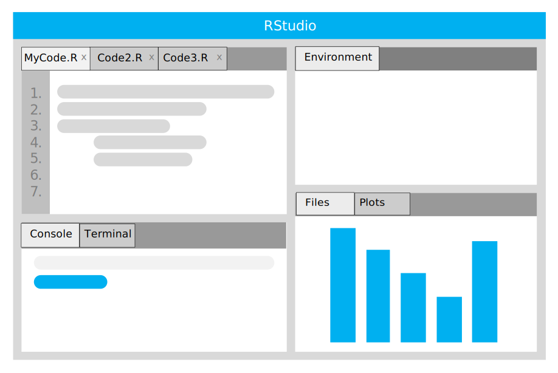

background-image: url(https://upload.wikimedia.org/wikipedia/en/6/6a/Logo_of_the_University_of_Sydney.svg)
background-size: 95%

```{r setup, include=FALSE}

options(htmltools.dir.version = FALSE)

knitr::opts_chunk$set(echo = TRUE, message = FALSE, warning = FALSE, 
                      dev = 'svg', out.width = "45%", fig.width = 6,
                      fig.align="center")

library(tidyverse)
library(sf)

```

---
class: inverse, center, middle

# Get started with SSPS4102

---

# What you need to take this unit

* No prior knowledge of statistics

--

* No coding experience

--

* Minimal maths background

--

* Install 
  * `r emo::ji("backhand index pointing right")` https://rstudio-education.github.io/hopr/starting.html

--

* Install  
  * also `r emo::ji("backhand index pointing right")` https://rstudio-education.github.io/hopr/starting.html

--

* Bring your laptop to class

--

* Come to class, complete readings and tasks **every week**

---

# Some tips


* Ask questions sooner than later.

--

* All seminar slides are available here:

  * Keep them open on your laptop in class to 

      * copy/paste code in RStudio; and

      * follow links.

---

# Textbook

* Llaudet, E., & Imai, K. (2022). _Data analysis for social science: A friendly and practical introduction_. Princeton University Press. https://press.princeton.edu/books/hardcover/9780691199429/data-analysis-for-social-science (DASS) 

  * This book is highly accessible and will introduce you to both R and important concepts for data analysis. It is a lighter version of Imai's _Quantitative social science: An introduction_ (we will refer to two chapters if QSS in this unit). 

  * Suggestion: Get the soft copy (PDF or Kindle) so to copy/paste the code... 

.center[]

  
---

# Other texts (1/2)

* Cairo, A. (2012). _The Functional Art: An introduction to information graphics and visualization_. New Riders. https://learning.oreilly.com/library/view/the-functional-art/9780133041187/ (FA)
  * Publicly and fully available online: NO
  * Library access: YES [link](https://sydney.primo.exlibrisgroup.com/permalink/61USYD_INST/1c0ug48/alma991031515966205106)
    * Online access: YES [link](https://learning.oreilly.com/library/view/the-functional-art/9780133041187/?ar=)
    * Hard Copy: YES

* James, G., Witten, D., Hastie, T., & Tibshirani, R. (2013). _An introduction to statistical learning: With applications in R_. Springer. https://www.statlearning.com/ (I2SL)
  * Publicly and fully available online: YES [link](https://www.statlearning.com/)

* Grolemund, G. (2014). _Hands-on programming with R_. O'Reilly. https://rstudio-education.github.io/hopr/ (HOPR)
  * Publicly and fully available online: YES [link](https://rstudio-education.github.io/hopr/)
  
---

# Other texts (2/2)

* Imai, K. (2017). _Quantitative social science: An introduction_. Princeton University Press. https://press.princeton.edu/books/paperback/9780691175461/quantitative-social-science (QSS)
  * Publicly and fully available online: NO
  * Library access: NO

* Silge, J., & Robinson, D. (2017). _Text mining with R: A tidy approach_. O’Reilly. https://www.tidytextmining.com/ (TMWR)
  * Publicly and fully available online: YES [link](https://www.tidytextmining.com/)

* Wickham, H., & Grolemund, G. (2017). _R for data science_. O'Reilly. https://r4ds.had.co.nz/ (R4DS)
  * Publicly and fully available online: YES [link](https://r4ds.had.co.nz/)

---

class: inverse, center, middle

# Content

---

# Content

This unit will introduce you (gently!) to 

1. computer programming with R, a language for [statistical computing](https://en.wikipedia.org/wiki/Computational_statistics).

2. concepts for data analysis and its practice using R.

## Learning goal in a nutshell

To analyse data to

1. Measure;

2. Explain; 

3. Predict.

---

# How to learn coding

* The challenge in this unit is that on top of learning data analysis concepts, you also need to learn to code with R... 

* but this is an opportunity:<sup>1</sup> data analysis concepts are always and immediately applied to data using R.

.center[]

.footnote[
[1] Of course, it is! This is very much a *feature* of the unit, not a *bug*!
]

---

# Learning outcome in a nutshell (1/4)


```{r}

fit <- 
  lm(Sepal.Length ~ Sepal.Width + Species, data = iris) 

summary(fit)

```


---

# Learning outcome in a nutshell (2/4)

```{r fig.height = 6, out.width = "50%"}

ggplot(fit, aes(x = Sepal.Width, y = Sepal.Length)) +
  geom_point() +
  geom_smooth(method = "lm")

```

---

# Learning outcome in a nutshell (3/4)

```{r echo = F}

fname <- 
  system.file("shape/nc.shp", package="sf")

nc <- 
  st_read(fname, quiet = TRUE)

```


```{r out.width="100%", fig.height = 2}

ggplot() + 
  geom_sf(data = nc, aes(fill = BIR74)) + 
  scale_y_continuous(breaks = 34:36) +
  scale_fill_distiller(palette = "YlGnBu")

```


---

# Weekly schedule

| Week |  Topic | Reading | Extra reading |
| :---: | --- | --- | --- | --- |
|01 | Introduction and overview | DASS Ch1.3-7 | HOPR [Ch1](https://rstudio-education.github.io/hopr/project-1-weighted-dice.html), [Ch2](https://rstudio-education.github.io/hopr/basics.html), [Ch3](https://rstudio-education.github.io/hopr/packages.html) | 
|02 | Measuring and summarising data | DASS Ch1.8 | HOPR [Ch5](https://rstudio-education.github.io/hopr/r-objects.html), [Ch6](https://rstudio-education.github.io/hopr/r-notation.html) | 
|03 | Data visualisation | R4DS [Ch3](https://r4ds.had.co.nz/data-visualisation.html) | FA [Ch1](https://learning.oreilly.com/library/view/the-functional-art/9780133041187/ch01.html), [Ch2](https://learning.oreilly.com/library/view/the-functional-art/9780133041187/ch02.html) | 
|04 | Data collection and manipulation | R4DS [Ch5](https://r4ds.had.co.nz/transform.html) | HOPR [Ch7](https://rstudio-education.github.io/hopr/modify.html), [Ch8](https://rstudio-education.github.io/hopr/environments.html) | 
|05 | Bivariate association and causality | DASS Ch2 | | 
|06 | Dimension reduction | I2SL Ch6.3 | | 

---

# Weekly schedule

| Week |  Topic | Reading | Extra reading |
| :---: | --- | --- | --- | --- |
|07 | Conducting reproducible research | DASS Ch3 | | 
|08 | Normal curve & confidence intervals | DASS Ch6 | | 
|09 | Hypothesis testing | DASS Ch7 | | 
|10 | Simple regression | DASS Ch4 | |
|11 | Multiple regression | DASS Ch5 | | 
|12 | Logistic regression and advanced topics | I2SL Ch4.1-3; QSS Ch5.2-3 |  
|13 | Computational text analysis | QSS Ch5.1 | TMWR [Ch1](https://www.tidytextmining.com/tidytext.html), [Ch2](https://www.tidytextmining.com/sentiment.html), [Ch3](https://www.tidytextmining.com/tfidf.html) |

---

class: inverse, center, middle

# Why R?

---

# Why R?

* Along with Python, R is the most popular language for data manipulation, analysis and reporting. 

* R is more popular with *social* scientists while Python is more popular with *computer* scientists.

* R is open-source [free software](https://en.wikipedia.org/wiki/Free_software). Everybody can use it and modify it. Its community is huge and constantly contributing new packages, features and documentation to the software. Likely, there is at least one package and a vignette to facilitate what you plan to do with your data. 

* RStudio, an excellent [integrated development environment (IDE)](https://en.wikipedia.org/wiki/Integrated_development_environment) for R, is also free. 

* R deals well with large, complex data sets.

---

# No-code / low-code software alternatives for data analysis (1/2)

* **Spreadsheet (Excel et al)**: Easy to access (likely your university or employer will give you access to it) and effective and intuitive for manipulating tabular data but limited in 
  * the type of analysis and visualisation they allow (e.g., no out-of-the-box linear regression `r emo::ji("sad")`);
  * the "shape" of data they can read: it can only be a table with rows and columns (i.e, no [API](https://en.wikipedia.org/wiki/API) data);
  * the size of the data they can read.
  
---

# No-code / low-code software alternatives for data analysis (2/2)
  
* **SPSS**: Sophisticated and easy to learn (yet, not that easy) but expensive. It is virtually only used in academia. Some limitation in terms of analytical tool (e.g. network and text analysis with additionally purchased software) 

* **Tableau**: Mostly focused on data visualisation. Very popular in the industry for business intelligence. Relatively expensive and limited in terms of analytical tool (e.g. no network or text analysis).

* **Power BI**: Mostly focused on data visualisation. Popular in the industry for business intelligence but less popular than Tableau. Relatively expensive and limited in terms of analytical tool (e.g. no network or text analysis). 
  
---

class: inverse, center, middle

# Getting started with R (and RStudio)

---

# What is the relation between R and RStudio?

**R** is the computer language that we use to set the instructions (our *code*). For example,

```{r}
x <- 42
```

is the R syntax to tell the computer to assign (`<-`) the numerical *value* `42` to the (variable) name `x`. The result of this line of code is either to change the value of `x` to `42` or to create a new variable in the current *environment*, name it `x` and assign to it the value `42`. 

**RStudio** is an [integrated development environment (IDE)](https://en.wikipedia.org/wiki/Integrated_development_environment) to facilitate (among other tasks)

* writing and debug R code (but other syntaxes such as Python are also supported), 
* run it,
* keep an eye on the objects (i.e. *data* and *values*) in my *environment*,
* import datasets,
* visualise plots,
* navigate local files,
* install packages.

---

# RStudio

.pull-left[

After launching RStudio, you should see four windows. Each windows has a number of tabs (like in a web browser). The most important tabs are:

]

.pull-right[

.center[]

]

1. **Upper-left window**: Your *code*. Each code file you have open appears in a different tab. 
2. **Upper-right window**: All the objects - *data* (e.g. dataframes), *values* (of your *variables*) and *functions* loaded in your environment are listed here. 
3. **Lower-right window**: Your local *files* and *plots* can be accessed from here. 
4. **Lower-left window**:  The *console*. Your R code will execute here. Code output (including errors and messages) is visualised here.

---


