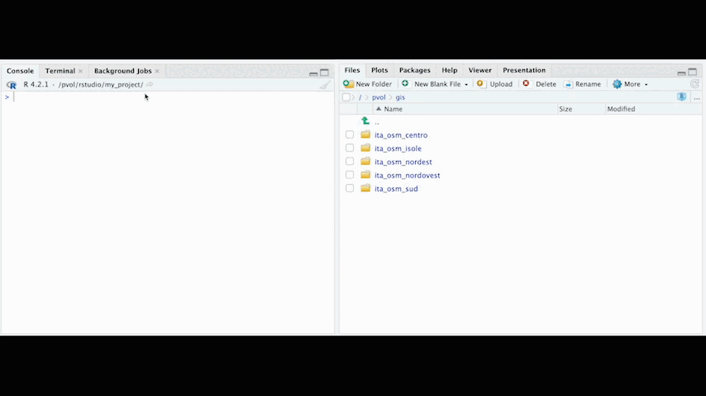
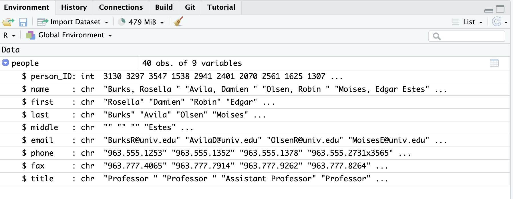

background-image: url(https://upload.wikimedia.org/wikipedia/en/6/6a/Logo_of_the_University_of_Sydney.svg)
background-size: 95%

```{r setup, include=FALSE}

options(htmltools.dir.version = FALSE)

knitr::opts_chunk$set(echo = TRUE, message = FALSE, warning = FALSE, 
                      dev = 'svg', out.width = "45%", fig.width = 6,
                      fig.align="center")

library(knitr)
library(kableExtra)
library(tidyverse)
library(sf)
library(DiagrammeR)

```

---

## Acknowledgement of Country

* would like to acknowledge the Traditional Owners of Australia and  recognise their continuing connection to land, water and culture. The  University of Sydney is located on the land of the Gadigal people  of the Eora Nation. * pay my respects to their Elders, past and present.


---

## Let's start with a question:

.center[</img> 

or https://www.menti.com/alfygs13yu5q 

(Mentimeter's answers are always anonymous and not recorded)]


---

<div style='position: relative; padding-bottom: 56.25%; padding-top: 35px; height: 0; overflow: hidden;'><iframe sandbox='allow-scripts allow-same-origin allow-presentation' allowfullscreen='true' allowtransparency='true' frameborder='0' height='315' src='https://www.mentimeter.com/app/presentation/alfweb93f1fyj647kvbpm2gs2fg1v153/embed' style='position: absolute; top: 0; left: 0; width: 100%; height: 100%;' width='420'></iframe></div>

---
class: inverse, center, middle

# The shape of data

---

## Information

### What is information?<sup>1</sup>  

When we talk about information we either intend 

1. Information *as* something; or 

2. Information *about* something

.pull-left[

A population **is** information because *objectively* contains information, from the information *stored* in the DNA of its people to the information *stored* in its social arrangements.  

]

.pull-right[

Information **about** the same population instead involves some medium - a message or a spreadsheet - where something or somebody has *encoded* and *stored* information *selectively* describing traits of that population. 

]

.footnote[
[1] Hidalgo, C. (2015). *Why information grows: The evolution of order, from atoms to economies*. Basic Books.

]

---

## Information as data

When we talk about data we intend information *about* something. That is, with the term "data" we refer to some information $AND$ the relation between that information and something (or somebody).

Let's take one of the objects we learned to create last week in R: `age <- 75`. `age` is an object of class "numeric". But is it information *as* something or *about* something? 

When you run the code `age <- 75` that information is "physically" stored in the memory of your computer. (And by *physically* * mean *physically*, as the physical order of your computer will in fact be different.) In this sense, this is information as *something*. 

And yet as social scientists we are not interested in that kind of physical information... What we want to know is: who is 75? As we link `75` to somebody and to the number of years that that person has lived we have information *about* something. We have a first **data point**.


---

## From information to data

In Latin, *data* is the plural of *datum*. Nowadays in the English language data is commonly use as singular, mass noun. But the singular/plural reflection is important because when we speak about data we refer to a collection and not to discrete values, which we would instead refer to as *datum* or more commonly *data point*. 

In conclusion, when we refer to *data* we intend 

.center[

A **collection** of

$\bullet$

**information** about

$\bullet$ 

**something**.

]

---

## The two critical relationships of data

Data exist because of two critical relationships:

1. The relations connecting data points within the data 

    * information $\iff$ information (e.g. "age:75" $\iff$ "name:Claire"); and

2. The relations between the information in the data and something outside of it

    * information $\iff$ something  (e.g, "name:Claire" $\iff$ `r emo::ji("woman")`).
    
    
If these relationships break, we don't have data anymore. **Data is fragile**!

.center[</img>]

---

## What are data sets? And what are data frames?

When we talk about *data sets* we tend to refer to data stored in a single rectangular (i.e. tabular) format. That is, one data set = one table, two data sets = two tables.  

In the R-verse, a dataset is known as a ...

.center[`data.frame`]

an R object you will frequently use.

---

## Data frames

In a data frame, each row is a different **observation** while each column is a different **variable**.<sup>1</sup>

```{r echo = FALSE}

library(MASS)

head(survey) %>%
  dplyr::select(Sex,Exer:Age) %>%
  kable()

```

.footnote[
[1] Although this is not the only way to order values in a data frame, it is the most common way to order in the social sciences.

]

---

## Now let's open Professor Elena Llaudet's slides 

(she is the author of our textbook...)

https://canvas.sydney.edu.au/courses/49127/files/folder/dass-slides?preview=29662524


---
class: inverse, center, middle

# Lab: Recap of Week 01

---
## Recap of Week 01 (1/3)

* Launching RStudio

* Installing packages

  * `install.packages(packages)`
  
* Loading packages

    * `library(package)` or 
  
    * `require(package)`

* Running simple calculations

    * `1 + 2` and 
  
    * `2 - 3` and 
  
    * `3 * 4` and 
  
    * `4 / 5`   
  
---
## Recap of Week 01 (2/3)

* Creating objects

    * `hello <- "hi"` or `hello = "hi"`

* Using functions

    * `function_name(arguments)` [don't run]
    
    * `package::function_name(arguments)` [don't run]

* Loading data

    * `load(file)` [don't run]

    * `read.csv(file)` [don't run]
  
---
## Recap of Week 01 (3/3)

* Making sense of data (and data *vector*, *matrices*, *data frames*)

    * Identifying type of R object
  
        * `class(dataframe)` 

    * Identifying length of vector
    
        * `length(numbers)`
  
    * Identifying number of rows (observations)
    
        * `nrow(dataframe)`
    
    * Identifying number of columns
  
        * `ncol(matrix)`
    
    * Identifying number of rows and columns
    
        * `dim(matrix)`
  
---
class: inverse, center, middle

# Lab

---
## Where am I? Where is my stuff?

### Understanding the working directory 

.pull-left[
.center[</img>]
]

.pull-right[
The working directory is the location of your current R process. RStudio shows your working directory at the top of your "Console" (usually, bottom-left window). In the figure is "~/Downloads/R-For-Non-Programmers/". 
]

To access files in your working directory, you don't need to specify any path, only the file name. E.g. `read.csv("my-table.csv")`. When you open an RStudio project the working directory is set to the project directory.

To change your working directory at any point you can use `setwd("/your/path/to/folder")`. If you want to get the working directory path instead `getwd()` with no argument. Let's try this...

---

## Your computer's file system

RStudio also gives you access to your system under "Files" in the bottom-right window.

Use "More" => "Copy Folder Path to Clipboard" to get a copy of the path of the directory you see open in the "Files" tab.

.center[</img>]

---

## Getting some data

Let's create a `data.frame` object first by reading in some data with `read.csv()`. With `head()`, we quickly get the first rows of our data frame.

```{r}
people <- 
  read.csv("https://raw.githubusercontent.com/lawlesst/vivo-sample-data/master/data/csv/people.csv")
```

```{r eval = F}
head(people)
```

```{r echo = F}
kbl(head(people)) %>%
  add_header_above() %>%
  kable_paper(bootstrap_options = "striped", full_width = F, font_size = 14)
```

---
## Getting the dimensions of your data frame

How many observations and columns do we have here?

```{r}

nrow(people)

ncol(people)

```

Or in just one function

```{r}
dim(people)
```

---

## Getting the names of the variables (columns)

The function `colnames()` will quickly let you know the names of the columns

```{r}
colnames(people)
```

Yet you can also get this information from RStudio in the "Environment" tab (top-right window):

.center[</img>]

---

## Accessing a single variable from your data frame

Once you have the names of your columns/variables you can access a single column by 


.center[`dataframe_name` + `$` + `column_name`]

so for example, to access the first name variable in the `people` data frame, we do

```{r}
people$first
```

---

## Accessing a single variable from your data frame

Similarly for the `email` variable we do 

```{r}
people$email
```

---

## Accessing a single variable from your data frame

Note that if you misspelled the name of the variable (including the wrong capitalisation), you will not get an error but you will get `NULL`. For example 

```{r}
people$Email
```

In some sense, the column with the wrong name exists but its value is `NULL`. 

Try to assign the value `NULL` to a column and see what happens to your data frame...

```{r}
people$email <- NULL
```

```{r}
colnames(people)
```

---

## Getting some new data

Let's get some other data now: 

```{r}
presidents <-
  read.csv("https://people.math.sc.edu/Burkardt/datasets/presidents/president_heights.csv")
```

```{r eval = F}
head(presidents)
```

```{r echo = F}
kbl(head(presidents)) %>%
  add_header_above() %>%
  kable_paper(bootstrap_options = "striped", full_width = F, font_size = 14)
```

Here we have two columns only: `Name` and `Height..inches.` (note that the dots `.` are part of the name!)

---

## Calculating a new variable

What do we have here? The height of US Presidents in... inches! Since we are not in the US we don't like inches, we want centimeters (note: $1 inch = 2.54 \times centimeter$)! 

How do we fix this? We create a new variable `height_cm` (no dots for us!) where the height is expressed in centimeters. 

```{r}
presidents$height_cm <- presidents$Height..inches. * 2.54
```

We have seen the  assign operator (`<-`) already. What it does it to take a value (or more values, like in this case) on its right-hand side and "assigns" it to the object on its left-hand side, which in this case is a column/variable in our data frame `presidents`. 

In this case `presidents$height_cm` didn't exist so `<-` will create a new variable. If the variable name is already used in the data frame, `<-` will replace the old values with a new set of values - writing over the old column. 

---

## Calculating the arithmetic mean (average) of a vector

The function to calculate the arithmetic mean of numerical values is (quite unsurprisingly) `mean()`. The function `mean()` takes as argument a vector of numerical values (of class `int` or `numeric`). Let's try it, by combining (with `c()`) values into a vector

```{r}
my_vector <- c(10, 100, 1000, 5000)
```

Then

```{r}
mean(my_vector)
```

<div class="tenor-gif-embed" data-postid="13572360" data-share-method="host" data-aspect-ratio="1.81818" data-width="40%"><a href="https://tenor.com/view/cool-minions-thumbs-up-good-job-ok-gif-13572360">Cool Minions GIF</a>from <a href="https://tenor.com/search/cool-gifs">Cool GIFs</a></div> <script type="text/javascript" async src="https://tenor.com/embed.js"></script>

---
## Calculating the mean of a variable 

We can then go back to our `presidents` data frame and calculate the mean of its variable. First, let's make trouble for the sake of it. Let's try to use as argument of `mean()` a `character` vector: `presidents$Name`

```{r warning = TRUE}
mean(presidents$Name)
```

Since `mean()` requires objects of class `numeric` or `int`, R tried to convert our string into numerical values without success producing `NA` (i.e. "'Not Available' / Missing Values") in the process. But the mean of `NA` is still `NA`. 

So what's the average (or expected) height of a US president in cm? Let me know with Mentimeter (link of the next page)

---

.center[</img> 

or https://www.menti.com/alfygs13yu5q 

(Mentimeter's answers are always anonymous and not recorded)]


