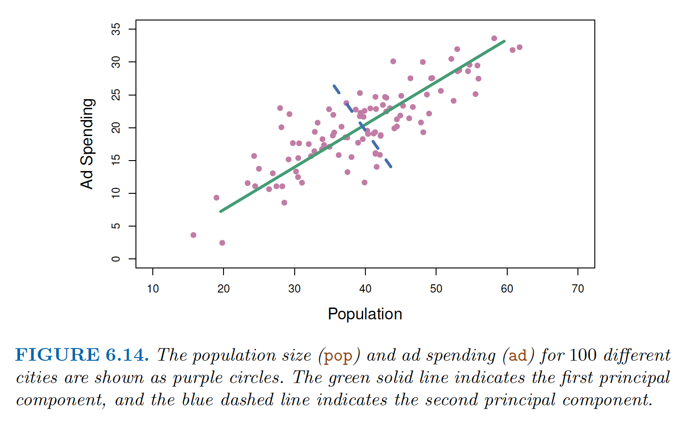

background-image: url(https://upload.wikimedia.org/wikipedia/en/6/6a/Logo_of_the_University_of_Sydney.svg)
background-size: 95%

<style>
pre {
  overflow-x: auto;
}
pre code {
  word-wrap: normal;
  white-space: pre;
}
</style>

```{r setup, include=FALSE}

options(htmltools.dir.version = FALSE)

knitr::opts_chunk$set(echo = TRUE, message = FALSE, warning = FALSE, 
                      dev = 'svg', 
                      fig.width = 4, 
                      fig.height = 4, out.width="30%",
                      fig.align="center")

library(knitr)
library(kableExtra)
library(tidyverse)
library(sf)
library(DiagrammeR)
library(cowplot)
library(haven)

ggplot2::theme_set(theme_bw())

```

---

## Acknowledgement of Country

I would like to acknowledge the Traditional Owners of Australia and recognise their continuing connection to land, water and culture. The  University of Sydney is located on the land of the Gadigal people  of the Eora Nation. I pay my respects to their Elders, past and present.

---
class: inverse, center, middle

# Principal component analysis

---

## Dimensionality reduction: An unsupervised learning problem

> In the **supervised learning** setting, we typically have access to a set of p features $X_1$; $X_2$ ... $X_p$, measured on $n$ observations, and a response $Y$ also measured on those same n observations. The goal is then to predict $Y$ using $X_1$; $X_2$ ... $X_p$.

> **[U]nsupervised learning** [is instead] a set of statistical tools intended for the setting in which we have only a set of features $X_1$; $X_2$ ... $X_p$ measured on $n$ observations. We are not interested in prediction, because we do not have an associated response variable $Y$. Rather, the goal is to discover interesting things about the measurements on $X_1$; $X_2$ ... $X_p$. Is there an informative way to visualize the data? Can we discover subgroups among the variables or among the observations? (James et al., 2021, p. 497)

*Principal component analysis* is an unsupervised technique. 

---

## Principalm component analysis (PCA)

> When faced with *a large set* of correlated variables, principal components allow us to summarize this set with *a smaller number* of representative variables that collectively explain most of the variability in the original set.  (James et al., 2021, p. 498)

PCA serves a data analyst in two ways

1. Create variables for supervised learning (i.e. indices);

2. Data visualisation tool (i.e. visualising on 2-3 dimensions, 3+ dimensions data)

---

## How PCA works? Introducing principal components

Think about a data frame containing responses to a survey. In this case, $n$ are the respondents or observations (the *rows* of our data frame) while $X_1$; $X_2$ ... $X_p$ are all the questions or variables (the *columns* of our data frame). So $n$ is the number of rows and $p$ is the number of columns.  

> The idea is that each of the $n$ observations lives in $p$-dimensional space, but not all of these dimensions are equally interesting. PCA seeks a small number of dimensions that are as interesting as possible, where the concept of interesting is measured by the *amount that the observations vary along each dimension*. Each of the dimensions found by PCA is a linear combination of the $p$ features. (James et al., 2021, p. 499)

The **dimensions** found by PCA are what we call principal components. 

---

## A geometric intepretation of PCA


</img> 
</br>
(James et al., 2021, p. 253)

---

## A geometric intepretation of PCA

.pull-left[
</img> 
</br>
(James et al., 2021, p. 253)
]

.pull-right[

The <span style="color:green">green solid line</span> is the *first principal component*. It is a linear combination of the two variables `pop` and `ad` but also the single straight line that captures most of the *variance* in the data. 

The <span style="color:purple">purple dashed line</span> is the *second* principal component, which is the linear combination of the two variables "that has *maximal variance* out of all linear combinations that are *uncorrelated* with" (James et al., 2021, p. 501) the first principal component.

]

---

## PCA: Loadings and scores

Let's load some sample data ...

```{r echo = F}
USArrests %>%
  dplyr::slice(1:5) %>%
  kbl() %>%
  kable_styling()
```

 (total observations: `r nrow(USArrests)`)

... and calculate the PCA for these four variables over the 50 observations (more on the code in the lab...)

```{r}
pr.out <- prcomp(USArrests, scale = TRUE)
```

Because there are four variables, `prcomp()` will calculate four principal components.

---

## PCA loadings

```{r}
pr.out$rotation
```

What you see here are the loadings from the PCA. Each column contains the *loading vector* of the corresponding principal component. 

*Loading* what? 

A *loading*, so a value in this table can be interpret as the *correlation* between a variable (rows) and a principal component (columns). A positive (negative) value indicates a positive (negative) correlation. A large value (positive or negative) indicates a strong correlation.

Loadings vector are very important if we want to explain single our PC and maybe treat them as independent variables (e.g. indices) to explain another variable. 

---

## PCA scores

But what if I want to know what are the values of a PC across the different *observations*? For example, let's say I want to know the *score* of PC1 for the observation "Alabama". 

```{r}
pr.out$x[1:5,]
```


PCA scores are the values of the new variable $PC_1$ ... $PC_p$ for the different observations in the data.

---

## Visualising PCA

```{r out.width = '70%', fig.width=8, fig.height=8}
biplot(pr.out, scale = 0)
```

---

## Visualising PCA

.pull-left[

```{r out.width = '100%', fig.width=8, fig.height=8, echo = F}
biplot(pr.out, scale = 0)
```

]

.pull-right[

Here we are visualising loadings and scores for the first two principal components (of course would be complicated to visualise more than 2d).

The coordinates (x and y) for 50 observations (US states) are determined by their **scores** for PC1 and PC2. 

The coordinates of the variable labels on the plot are determined by their **loadings** for PC1 and PC2. 

]

<br>

How can we interpret this?

---

## T-distributed Stochastic Neighbor Embedding (t-SNE)

What the living hell is that? 😱

Let's not dive in to the maths here, let's just say that (t-SNE) does what PCA does: it takes a bunch of variables and find a smaller number of dimensions to represent the variance in the data. (Note: In times of data abundance, dimensionality reduction is a common problem for everybody. Common problem + lot of 💵 = a lot of solutions.) 

```{r}
require(Rtsne)
tsne.out <- Rtsne::Rtsne(USArrests, dims = 2, perplexity = 10)
```

`Rtsne()` works similarly to `prcomp()` but note that with t-SNE we can specify the number of dimensions to return (here `dims = 2`). With PCA we always get as many dimensions (a.k.a. principal components) as input variables - and you will need to decides how many you need.

---

## PCA vs t-SNE

.center[
</img>
]

Let's compare the results from the two dimensionality reduction techniques on the same data.

---

### PCA vs t-SNE

.pull-left[

#### PCA 

```{r}
pr.df <- 
  data.frame(pr.out$x)

pr.df$state <- 
  rownames(USArrests)
```

```{r echo = F}
pr.df %>%
  dplyr::slice(1:5) %>%
  dplyr::select(PC1, PC2, state) %>%
  kable(row.names = FALSE)
```


]

.pull-right[

#### t-SNE
```{r}
tsne.df <- 
  data.frame(tsne.out$Y)

tsne.df$state <- 
  rownames(USArrests)

```

```{r echo = F}
tsne.df %>%
  dplyr::slice(1:5) %>%
  kable()
```

]

---

.pull-left[

#### PCA 

```{r out.width = "100%", fig.width = 6, fig.height = 6}
pr.df %>%
  ggplot(aes(x = PC1, y = PC2, 
             label = state)) +
  geom_text()
```

]

.pull-right[

#### t-SNE

```{r out.width = "100%", fig.width = 6, fig.height = 6}
tsne.df %>%
  ggplot(aes(x = X1, y = X2, 
             label = state)) +
  geom_text()
```

]


---
class: inverse, center, middle

# Indices in the social sciences

---

## Why do we need an index?

A common situation for social scientists is to work with survey results administered through questionnaires. Yet surveys might contain dozens of questions. Too many include them all in our statistical analysis (as we always need to explain them!). 

.center[</img>]

---

## Why do we need an index?

This problem is commonly refer to by computer and data scientists as **dimensionality reduction**. 

.pull-left[
.center[</img>]
]

.pull-right[

Dimensionality reduction is just about using some technique (usually a statistical tecnique) to compress the information we have so that instead of *n* dimensions we have a more manageable number of dimensions to work with (where *n* can be 50 or 50 millions).

]
</br>
The point is of course to reduce the number of variables by keeping as much of the original information as possible. One of the most common approach to do it is to look for statistical correlations among variable - because if they are correlated, we can use the pattern of the correlation instead of all the individual correlated variables (this is what PCA does).


---

## Why do we need an index?

Social scientists generally refer to a variable that captures information from multiple variables (e.g. survey responses) as an **index**.

Social scientists like to construct indices not only because it is easier to work and report on one variable instead of 10 variables. They construct indices also for theoretical reasons; as they want to construct measures (a.k.a "operationalisation") to capture complex theoretical concepts.

Through surveys we try to capture and measure complex concepts. Yet, complex concepts usually can't be captured in a single, direct question. 

Instead, researchers *operationalise* the measurement of that concept through multiple questions. For example...

---

## Why do we need an index?

Measuring the level of democracy in a country with a questionnaire:

```{r, echo = F, out.width = "100%"}

DiagrammeR::grViz("digraph {
  graph [layout = dot, rankdir = LR] 
  
  node [shape = oval]        
  nod1 [label = 'High-level\nconcept']
  nod2 [label = 'Low-level\nmeasurable variable(s)']
  nod3 [label = 'Democracy']
  nod4 [label = 'Q1']
  nod5 [label = 'Q2']
  nod6 [label = 'Q3']
  nod7 [label = 'Q4']


  nod1 -> nod2; nod3 -> nod4; nod3 -> nod5; nod3 -> nod6; nod3 -> nod7;
  }", 
  height = 300)

```

*Q1*: Overall, is the condition of democracy and human rights in your main country of focus today mostly strong or weak?

*Q2*: Overall, do you approve the national government's job on democracy and human rights?

*Q3*: ... 

---

## Why do we need an index?

So once we have collected our responses (four in the example before), we might want to bring them back into a single measure.

For example, a *democracy index*.

```{r, echo = F, out.width = "100%"}

DiagrammeR::grViz("digraph {
  graph [layout = dot, rankdir = LR] 
  
  node [shape = oval]        
  nod3 [label = 'Democracy index']
  nod4 [label = 'Q1']
  nod5 [label = 'Q2']
  nod6 [label = 'Q3']
  nod7 [label = 'Q4']


  nod4 -> nod3; nod5 -> nod3; nod6 -> nod3; nod7 -> nod3;
  }", 
  height = 300)

```

---
class: inverse, center, middle

# Lab

---

## Preparing your variables

Once you have selected the variables to use for the index, you must prepare them. In other words, you need to make sure that they can be treated as numerical (you are going to average them!) and that you exclude all the values that do not make numerical sense in your averaging. 

An example will hopefully help us understand the problem...

---

## Loading the packages we will need

```{r}
library(dplyr)
library(haven)
```


### To install these packages (if you need to...)

```{r eval = F}
install.packages("dplyr")
install.packages("haven")
```

## Loading the data 

You can download the data file itanes_2013.RData from Canvas. Then load it into your R session with

```{r}

# Path to file likely different on you computer
load("../data/itanes_2013.RData") 
# Note: You can also open and load an .RData file into your current R 
# session simply by clicking on it.

```

The data file itanes_2013.RData contains a single data frame, named `itanes_2013`, which was originally created reading the SPSS data file the responses to four questions of the *Italian National Election Survey 2013*, plus the `sex` of the respondent.

```{r}
head(itanes_2013)
```

---

## Inspecting the data 

As we observe the variables are of type `dbl+lbl`. What is that?? 

For our purpose, we shouldn't worry to much about their label, as we can treat these variables as simple numerical variables (`double` or `dbl` for short) disregarding the information contained in their labels (or `lbl` for short).

But if we want to use them as categorical variables (that is, *factors*) instead of numerical we can transform them with the function `haven::as_factor()`. 

.pull-left[

```{r}

itanes_2013$d38_1[1]

```

]

.pull-right[

```{r}

haven::as_factor(itanes_2013$d38_1[1])

```

]

---

## Codebook

This is the description of the four questions provided by the codebook. 

> #### Section 10: Efficacy 
> D38. For each of the following statements, could you tell me to what degree they are true, in your opinion?
> * D38_1. People like me don’t have any say in what the government does. 
> * D38_2. Sometimes politics and government seem so complicated that a person like me can’t really understand what’s going on. 
> * D38_3. Usually, people we elect to the Parliament quickly lose touch with the people. 
> * D38_4. Parties are only interested in people's votes, but not in their opinions. 
>
> [1] Not at all true [2] Not quite true [3] Fairly true [4] Completely true  [5] Don't know [6] No answer 

---

## Transforming our variables into an index

Based on the codebook we note two things:

1. The four questions (D38_1, D38_2, D38_3 and D38_4) are all about *political efficacy*. Efficacy is an important concept in the political sciences, although not something you can directly ask to your respondents ("What is your sense of political efficacy on a scale from 1 to 10?" will hardly get any meaningful response...). Therefore a single dimension (here, political efficacy) has been measured with four distinct questions. 

2. All questions have the same set of possible answers (multiple-choices):

    * [1] Not at all true 
    * [2] Not quite true 
    * [3] Fairly true 
    * [4] Completely true 
    * [5] Don't know 
    * [6] No answer
    
    Where a value of `1` in the variable corresponds to the answer "Not at all true" and so on...
    
    
---

## Transforming our variables into an index

We immediately realise that we can place these answers on a numerical scale as they are ordered and equally distanced (or so we can quite legitimately consider them).

So let's consider the 42nd respondent in our data frame (where $i = 42$, no particular reason to pick 42...). 

---

```{r}
itanes_2013$d38_1[42]
```

```{r}
itanes_2013$d38_2[42]
```

---

```{r}
itanes_2013$d38_3[42]
```

```{r}
itanes_2013$d38_4[42]
```

---

## Transforming our variables into an index

Their answers to the four questions are respectively: 3, 4, 4 and 3. Since we can treat these variables as continuous, it makes total sense to sum them up 

.center[
$d38\_1_{42} + d38\_2_{42} + d38\_3_{42} + d38\_4_{42} = `r sum(c(3, 4, 4, 3))`$
]

or to average them 

.center[
$\frac{d38\_1_{42} + d38\_2_{42} + d38\_3_{42} + d38\_4_{42}}{4} = `r mean(c(3, 4, 4, 3))`$
]

Given these questions, the sum or the average can be effectively considered an efficacy *index*. 

And we can use this index to compare across our sample: $respondent_{42}$ has expressed a *weaker*<sup>1</sup> sense of political efficacy than $respondent_{1}$ as

.center[
$\frac{d38\_1_{1} + d38\_2_{1} + d38\_3_{1} + d38\_4_{1}}{4} = `r mean(c(1, 4, 2, 2))`$
]

.footnote[
[1] Look closely at questions and answers to understand the direction of your index. Here statements are negative ("PARTIES ARE ONLY INTERESTED IN PEOPLE'S VOTES...") and answers move from disagreement to agreement.
]

---

## Transforming our variables into an index

#### Then shall we sum our values across the variables we want to use to construct the index or shall we average them? 

Most of the times, the two approaches will substantially produce the same result. 

Yet, if the average index will be expressed on the same scale set by the questionnaire (so in our case on a 1-to-4 scale), the scale of the sum index will be expressed on a scale that depends on how many questions we are aggregating for the index (in our case in the range 1 to 16 (as $4 \times 4 = 16$). 

In general, (I think) that averaging instead of summing is the most intuitive solution as it is easier to interpret: an index value of 3.5 will be halfway between "Fairly true" and "Completely true". 

---

## Transforming our variables into an index

But we still have a problem. Let's look again at the multiple choices:

> * [1] Not at all true 
> * [2] Not quite true 
> * [3] Fairly true 
> * [4] Completely true 
> * [5] Don't know 
> * [6] No answer
    
If it evidently makes sense to average responses in the range 1 to 4, it doesn't to place `5` ("Don't know") and `6` ("No answer") on the same scale. 

If we do, we would implicitly assume that the answers "Don't know" and "No answer" express a stronger agreement to the statement than all the other answers (i.e. 1, 2, 3 and 4). 

---

## Transforming our variables into an index

The scale we are interested in, to capture political efficacy, is in the range 1 to 4 (again with `4` indicating less efficacy and `1` more efficacy, given how questions and answers are expressed). 

The other answers (`5` and `6`) should not treated as numbers. We have to options:

1. We can replace `5` and `6` with `NA` (or "Not Available", or missing) and then still compute the average (i.e. our *index*) for the respondents who have responded `5` or `6` to some of the questions, from on the other responses.

2. We can *filter out* all the records where a responded has responded `5` to `6` to any of the four political efficacy questions.

In most scenarios, solution number 2 is probably the most appropriate. Why?

---

## Summing and averaging with missing values

Let's consider these two respondents ( $i=3$ and $i=42$ ):

```{r, echo = F}
itanes_2013[3,] %>%
  dplyr::select(d38_1:d38_4) %>%
  knitr::kable(caption = "Respondent 3")
```

which then becomes

```{r echo = F}

replace_fun <- function(x) {ifelse(x > 4, NA, x)}

itanes_2013 <- 
  itanes_2013 %>%
  dplyr::select(d38_1:d38_4) %>%
  dplyr::mutate_all(replace_fun)
```


```{r, echo = F}

itanes_2013[3,] %>%
  knitr::kable(caption = "Respondent 3") 
```

---

## Summing and averaging with missing values

.pull-left[

```{r, echo = F}

itanes_2013[3,] %>%
  knitr::kable(caption = "Respondent 3") 
```


]

.pull-right[

```{r, echo = F}
itanes_2013[42,] %>%
  knitr::kable(caption = "Respondent 42") 
```

]

</br>

Our $index_{3}$ will be **`r sum(as.numeric(itanes_2013[3, 1:4]), na.rm = T)`** if we sum the values and **`r round(mean(as.numeric(itanes_2013[3, 1:4]), na.rm = T),2)`** if we average them.

Our $index_{42}$ will be **`r sum(as.numeric(itanes_2013[42, 1:4]), na.rm = T)`** if we sum the values and **`r round(mean(as.numeric(itanes_2013[42, 1:4]), na.rm = T),2)`** if we average them.

How does $index_{3}$ compare with $index_{42}$? 

$index_{3}$ is strongly penalised with the sum as in fact we are replacing the "Don't know" with a value of **0** weighting the index down relatively to the other respondent with complete responses. 

Using the average instead we don't penalise $index_{3}$. Still we are in fact *imputing* an answer somewhere between "Fairly true" and "Completely true" when instead the respondent said "Don't know".

Because of this I would argue that the most appropriate solution is usually to drop the record altogether. Let's see how....

---

## Filtering for missing values before summing and averaging

If we want to replace a range of values we can do this with `dplyr::filter()`. 

Specifically to our case, we want to set the conditions to filter out all records (i.e. respondents) that have answered `5` or `6` to any of the questions of interest. 

Since, our variables are numerical we can use the logical operator `<` ("less than") and the logical `var < 5` to only include records where `var` is either `1`, `2`, `3` or `4` (all numbers that are smaller than 5). We also need to use `&` to set more than one condition (we need one condition for each variable).

We will store the results of our filtering out creating a new data frame `itanes_2013_filterd` (because it is a good idea to keep the original data somewhere).

```{r}
itanes_2013_filtered <-
  itanes_2013 %>%
  dplyr::filter(d38_1 < 5 & d38_2 < 5 & d38_3 < 5 & d38_4 < 5)
```

---

## Creating our index as new variables of a data frame

We are now in the position to create our indices (let's create both `index.sum` and `index.avg`) as new variable of our new data frame ( $n = `r nrow(itanes_2013_filtered)`$, down from $n = `r nrow(itanes_2013)`$ of the original data frame)

```{r}
itanes_2013_filtered <- 
  itanes_2013_filtered %>%
  dplyr::rowwise() %>%
  dplyr::mutate(index.sum = sum(c(d38_1, d38_2, d38_3, d38_4)),
                index.avg = mean(c(d38_1, d38_2, d38_3, d38_4)))
  
```


Note that with dplyr we need to functions to create the index. First, we need to specify that our `sum()` and `mean()` should be calculated row-wise (so one sum/mean for each row) and not column-wise (so one sum/mean for the entire data frame). Second, we need to use `mutate()`, where we create two variables (`index.sum`/`index.avg`) from the row-wise sum/average of this variables: `c(d38_1, d38_2, d38_3, d38_4)` (note that the variable names must be concatenated with `c()`).

---

## Inspecting the distribution of sum and average indices

```{r out.width = "90%", fig.height = 3, fig.width = 5}
ggplot2::ggplot(itanes_2013_filtered, 
       aes(index.sum)) +
  ggplot2::geom_bar() +
  labs(x = "<- stronger    sense of efficacy   weaker ->")
```

---

## Inspecting the distribution of sum and average indices

```{r out.width = "90%", fig.height = 3, fig.width = 5}
ggplot2::ggplot(itanes_2013_filtered, 
       aes(index.avg)) +
  ggplot2::geom_bar() +
  labs(x = "<- stronger    sense of efficacy   weaker ->")
```

---

## Inspecting the distribution of sum and average indices

As you can see, since we dropped the records with missing values the two charts are different only in terms of the horizontal axis.

Let's now see how we can construct an index with the same variables but using principal component analysis... 


---

## Constructing an index with Principal component analysis

Principal component analysis (PCA) is a *dimensionality reduction technique* - like summing or averaging, but more sophisticated. In James et al. (Section 12.2, 2021, p. 488),<sup>1</sup> we read a justification for PCA:

> When faced with a large set of correlated variables, principal components allow us to summarize this set with a smaller number of representative variables that collectively explain most of the variability in the original set.

So instead of using 4, 5, 10, 20 or 2000 variables, we use a more manageable number of variables. Yes, but how many?

.footnote[[1] James, G., Witten, D., Hastie, T., & Tibshirani, R. (2021). 12 Unsupervised learning. *In An introduction to statistical learning: With applications in R*. Springer. https://link.springer.com/chapter/10.1007/978-1-0716-1418-1_12 <mark>Note: if you are accessing the 2013, the  Unsupervised learning chapter is number 10 (the section on principal component is still number 2)</mark>  
]

---

## Constructing an index with Principal component analysis

PCA gives us the information to make a informed decision on how many variables we can use as an acceptable summary of our initial (large) number of variables. 

Let's see how using our previous example: the four variables capturing answers about political efficacy. 

---

## Calculating principal components

To do a PCA on a data frame is relatively simple in R, with the `pca_result()` function. With a data frame, the code looks like this:

```{r eval = F}

prcomp(data, scale = TRUE)

```

A few notes:

1. All the variables (columns) that `prcomp` finds in the `data` will be used for PCA. If I don't want to use a variable (e.g. `sex`) I will need to remove it from the data frame I use with `prcomp()`.

2. `prcomp()` doesn't accept any missing value (`NA`). I will need to remove all the records containing missing values.

3. `prcomp()` doesn't return a single vector or a data frame. But a objects with different values and statistics (similarly to `lm()` which fits linear multivariate models).s

---

## Calculating principal components

Let's then first prepare my data frame for PCA.

```{r}

itanes_2013_filtered_selected <- 
  itanes_2013 %>%
  dplyr::filter(d38_1 < 5 & d38_2 < 5 & d38_3 < 5 & d38_4 < 5) %>%
  dplyr::select(d38_1, d38_2, d38_3, d38_4)

```

With we `filter()` *out* as before all records with responses "I don't know" or "No answer". with `select()` we only select the column we are using for PCA. 

We store the resulting new data frame in `itanes_2013_filtered_selected`. We are now ready to use the PCA function:

```{r}
pca_result <- 
  prcomp(itanes_2013_filtered_selected, scale = TRUE)
```

.footnote[Note: Let's not worry about `scale = TRUE` for now. Just make sure to specify it when you use `prcomp()`.]

---

## Inspecting the results of PCA with summary()

```{r}
summary(pca_result)
```

The `summmary()` function on the results of `prcomp` will give me this summary statistics. How do I read it?

First, we need to understand that a PCA on four variables (as in this case) will return four *new* variables, called principal components: so PC1, PC2, PC3 and PC4. 

The most important information at this stage for each new PC is the "Proportion of Variance". That is, how much variance of the original variable is captured by each PC.

As you can see, the new PC are ordered so that PC1 captures more variance than PC2 and so on...

---

## Choosing how many principal components to use

Since PCA is usually done to reduce the number of variables we need to deal with, we need to decide how many PCs are enough. In this case, the first PC (so PC1) is already explaining more than 50% of the variance of the four original variables. And this makes PC1 a legitimate candidate for an political efficacy index.

Sold! But how do we get PC1 out of `pca_result`?

All the new variables (PC1, PC2, PC3, ...) are stored in a data frame that we reach using `pca_result$x` (note the `$` sign again to access the object `x`).

```{r}
head(pca_result$x)
```

---

## Storing our principal component back in our data frame

Once we have decided to use PC1 as our index we can, save it as a new varible of the data frame we used for the principal component analysis

```{r}
itanes_2013_filtered_selected$index.pca <- 
  pca_result$x[,1]
```

Note: `[,1]` selects the first column of a matrix or data frame (in this case we are dealing with a matrix stored in `pca_result$x`).

---

## Inspecting the distribution of our new index

```{r out.width = "90%", fig.height = 3, fig.width = 5}
ggplot2::ggplot(itanes_2013_filtered_selected, 
                aes(index.pca)) +
  ggplot2::geom_density() +
  labs(x = "<- stronger    sense of efficacy   weaker ->")
```
