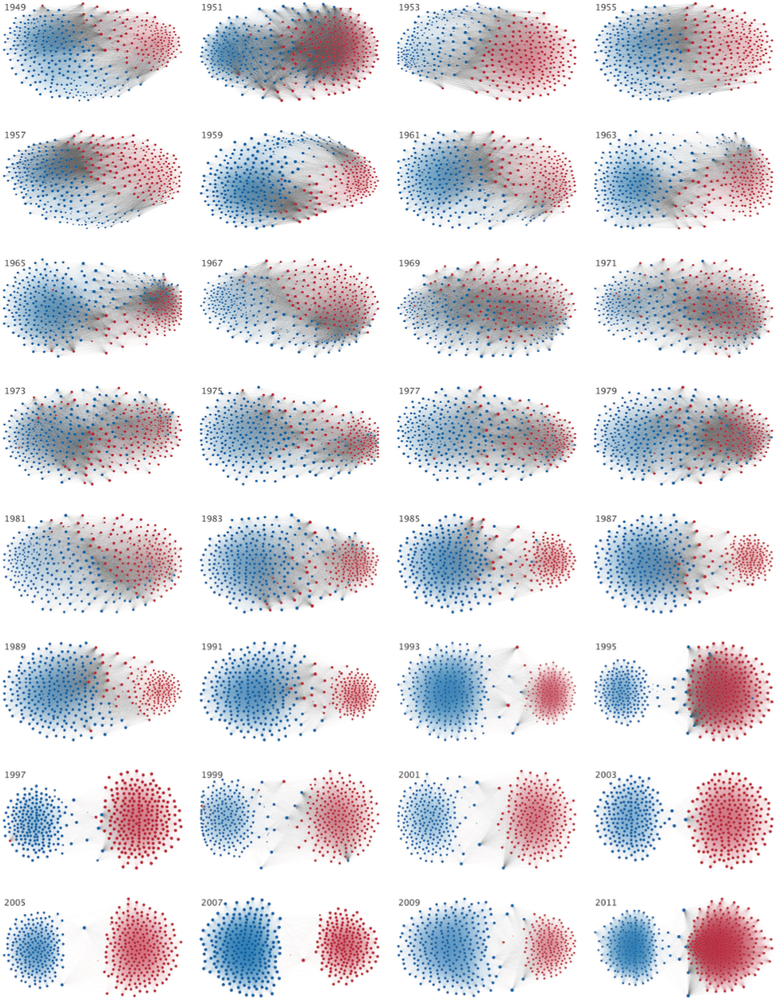
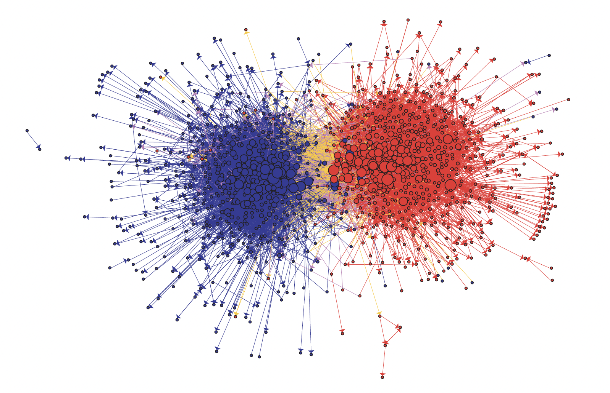
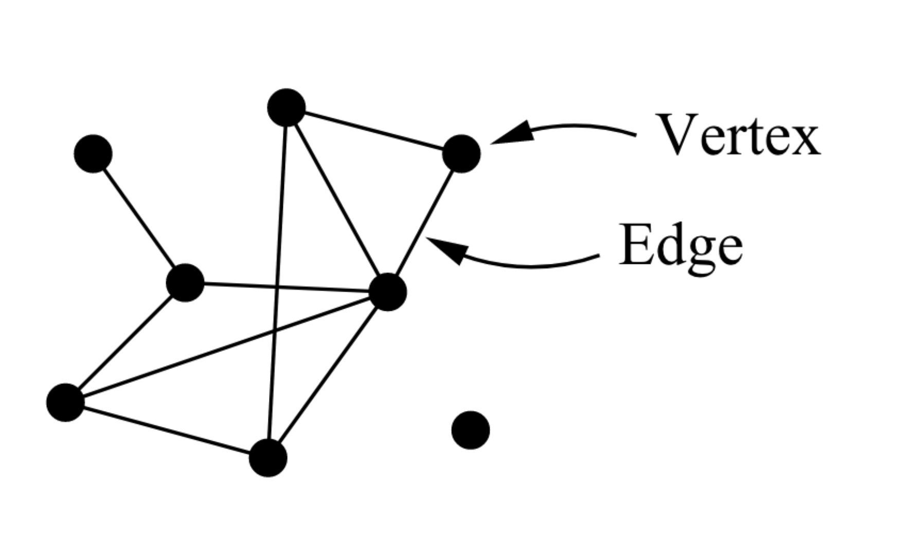
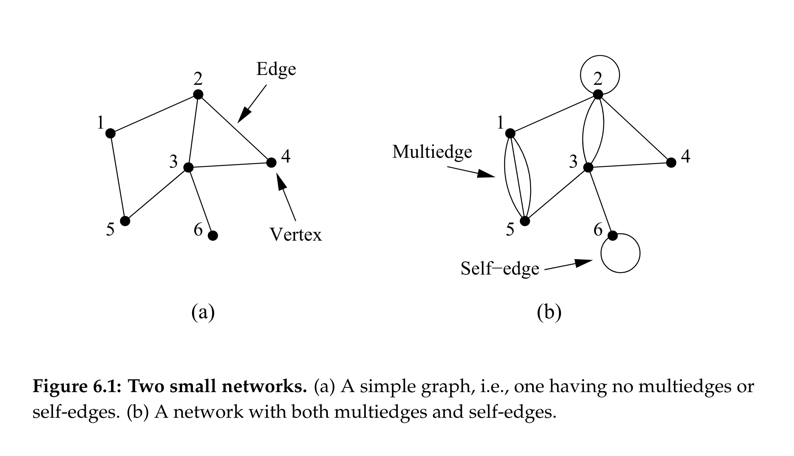
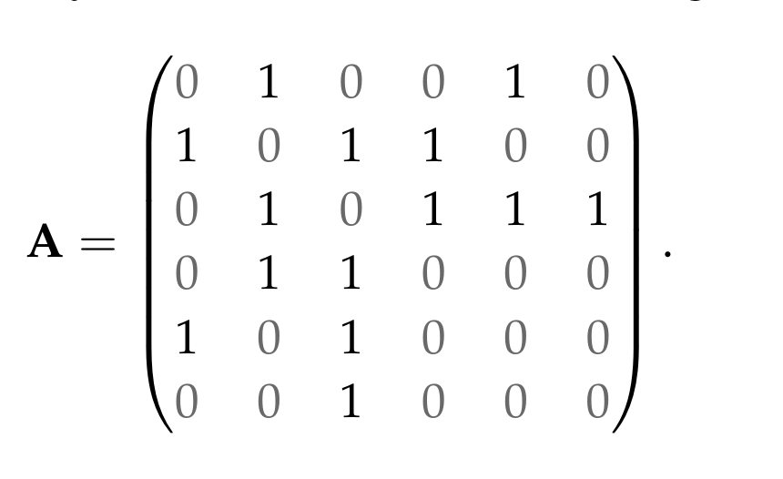
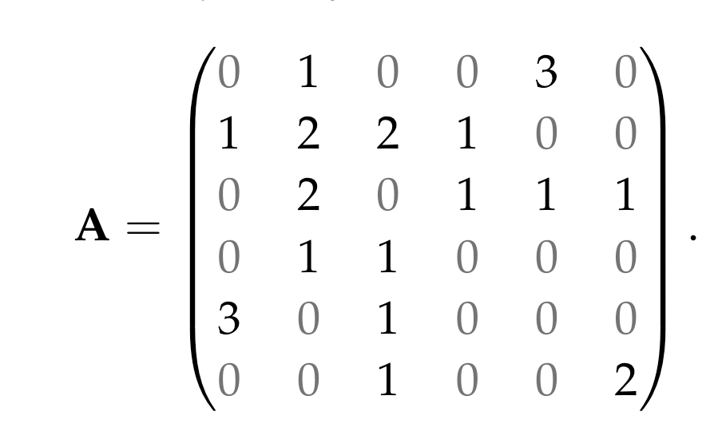

background-image: url(https://upload.wikimedia.org/wikipedia/en/6/6a/Logo_of_the_University_of_Sydney.svg)
background-size: 95%

<style>
pre {
  overflow-x: auto;
}
pre code {
  word-wrap: normal;
  white-space: pre;
}
</style>

```{r setup, include=FALSE}

options(htmltools.dir.version = FALSE)

knitr::opts_chunk$set(echo = TRUE, message = FALSE, warning = FALSE, 
                      dev = 'svg', 
                      fig.width = 6,
                      out.width="45%",
                      fig.align="center")

library(knitr)
library(kableExtra)
library(tidyverse)
library(sf)
library(DiagrammeR)
library(cowplot)
library(haven)

ggplot2::theme_set(theme_bw())

options(scipen = 100)

```

---

## Acknowledgement of Country

I would like to acknowledge the Traditional Owners of Australia and recognise their continuing connection to land, water and culture. The  University of Sydney is located on the land of the Gadigal people  of the Eora Nation. I pay my respects to their Elders, past and present.

---

class: inverse, middle

Plan for today ... 

## Regression analysis

### Categorical variables as IV

### Logistic regression

## Advanced topics

### Network analysis

### Spatial analysis

(If we don't have time to cover everything we will finish next week)

### (Text analysis next week)

---

.center[</img>]


---

.center[</img>]

(We learned about computing 95% confidence interval for difference-in-means estimators in Week 9...)

And with this in mind...

---

## Please complete the Unit of Study Survey for SPSS4102 (if you haven't yet) 

<mark>Your feedback is critical!</mark>

* Past USS results have been used to improve this unit.

* Your feedback will help us keep improving it.

<mark>Please, do it now by visiting</mark>

.center[https://student-surveys.sydney.edu.au/students/]

or use the QR code

.center[</img>]


```{r echo = F}
library(countdown)
countdown(minutes = 8, seconds = 00)
```

---

class: inverse, center, middle

# Regression analysis

## Categorical variables in regression models

## Logistic regression

---

## Categorical variables in regression models

Consider this example

```{r}

hsb2 <- 
  read.csv("https://stats.idre.ucla.edu/stat/data/hsb2.csv") %>%
  dplyr::select(write, read, female, race)
summary(hsb2)
```

Both `female` and `race` are stored as `integer` (numeric) values. But clearly they are not continuous variables: they are categorical non-ordinal variables. 

How to use the correctly as *independent variables* in a regression model?

---

## Binary variables as independent variables

Generally, binary variables do not need any recording. A binary variable stored as an integer (0, 1) is perfectly interpretable as coefficient. 

It is only important to understand what is coded as 0 and what is coded as 1. In this case, the name of the variable (`female`) would imply that `male = 0` and `female = 0`. 

---

### Binary variables as independent variables

Consider this (the `coef()` function only get the coeffience from a lm object):

```{r}
coef(lm(formula = write ~ female, data = hsb2))
coef(lm(formula = read ~ female, data = hsb2))
```

We interpret these coefficients as

On average, a `female` student is expected to score 

* 4.87 points *more* **than** a `male` student in the `write` test and

* 1.09 *less* **than** a `male` student in the `read` test. 

*Remember*: With linear models, $\beta$ corresponds to the change of $Y$ from a one-unit change of $X$ and here $X$ changes from male (0) to female (1)

---

## Categorical (non-ordinal) as independent variables

But then consider this

```{r}
fit <- lm(formula = write ~ race, data = hsb2)
coef(fit)
```

What's the problem here?

Again, $\beta$ corresponds to the change of $Y$ from a one-unit change of $X$ and here $X$ changes from race1 to race2, or from race2 to race3, ...

This of course doesn't make any sense. The race variable can't be used as a continuous variable. I need to recode it as a **factor**!

---

### Categorical (non-ordinal) as independent variables

```{r}
hsb2 <- hsb2 %>% dplyr::mutate(race.f = factor(race)) #<<
summary(hsb2$race.f)
fit <- lm(formula = write ~ race.f, data = hsb2)
coef(fit)
```

Wait a minute, where is `race.f1`?

---

### Categorical (non-ordinal) as independent variables

The first level of the factor `race` - in this case `race = "1"`, but it could have whatever string label - is the *base* level and all the other coefficients should be intended as the change on $Y$ from the 

* change of `race = 1` to `race = 2`, corresponding to $\beta_1=11.542$; 

* and from `race = 1` to `race = 3`, corresponding to $\beta_2=11.542$; 

* and finally from `race = 1` to `race = 4`, corresponding to $\beta_3=7.597$

When we use a categorical variable in a regression, we are indeed asking to estimate a different coefficients for each level of the variable, excluding the first one, which is the base level for all the coefficients.

---

You should then interpret regression results as you would for any other independent variable...

```{r}
summary(fit)
```


---

class: inverse, center, middle

# Logistic regression

---

## Why can't we just use a linear regression?

Linear regression assumes the dependent variable $Y_i$ to be **quantitative**, that is, to be a variable scoped over a infinite, continuous range.   

$$Y_i = \underbrace{\alpha}_{intercept} + \underbrace{\beta}_{slope} \times X_i + \underbrace{\epsilon_i}_{error\:term}$$

Notably, the regression line which is the line that best fits the points (defined by the equation above), does not *begins* or *ends*. In fact, you can plug any number you can think of as value of $X$ and obtained an estimated $\widehat{Y}$. 

This problem is called **extrapolation**. Extrapolation means that you get a trend from your data points, a regression line, and use it to predict outside of the range of your sample data and the "scope of the model". 

---

## Why can't we just use a linear regression?

.center[</img>]

Source: xkcd.com


---

## Why can't we just use a linear regression?

.center[</img>]

Source: xkcd.com


---

## When is (probably) OK to use a linear regression

#### Variables that are continuous but can only assume positive values

$$votes = \alpha + \beta_1 \times approval$$
The model might also estimate that given a (very low) approval rate, the candidate is *likely* to receive a *negative* number of votes. This clearly doesn't make sense and yet a regression line can still be a very useful (therefore justifiable) approximation of what is going on in the real world.

#### Variables that are continuous but can only assume values in the range 0 to 1 (proportions).

Similarly to above, if we express $votes$ as a proportion of total votes, it is still justifiable to use a regression line, even if doesn't make any sense to receive 105% of the votes (which is something the model can legitimately predict).  

---

## When is (probably) OK to use a linear regression

#### Variables that are continuous but can only assume values in the range 1 to 5 (e.g Likert scale answer).

If our dependent variable is a response of a survey with values limited to a small range, we can probably still treat it as a continuous variable (although the variable is more accurately an *ordinal* variable: categorical but ordered).  

---

## When is (definitely) NOT OK to use a linear regression


Suppose we have this data set (James et al., 2021, p. 131)

\begin{equation}
    Y =
    \begin{cases}
      1 & \text{if}\ stroke; \\
      2 & \text{if}\ drug\ overdose; \\
      3 & \text{if}\ epileptic\ seasure.
    \end{cases}
\end{equation}

 Clearly, in this circumstance although the different cases are coded as a *quantitative* variable, they in fact are a *qualitative* response!
 
---

## Is it OK to use a linear regression with a binary outcome variable?

Although it is possible to do it - as the parameters the regression is going to estimate for you are *meaningful* in their interpretation (e.g. coefficients, p-values), it is more appropriate to treat the problem as a *classification* problem and use a **logistic regression** (more on this soon!). 
 
> To summarize, there are at least two reasons **not to perform classification using a regression method**: 

> * (a) a regression method cannot accommodate a qualitative response with more than two classes; 

> * (b) a regression method will not provide meaningful estimates of $Pr(Y |X)$, even with just two classes. (James et al., 2021, p. 132)
 
---

## Logistic regression

* A logistic regression is model that works similarly to the linear regression. 

* But the key difference is that for any value of the independent variable $X$, the logistic regression will estimate (with a *logistic function*) outcomes that are *limited* to values between 0 and 1.

$$log \left( \frac{p(X)}{1-p(X)} \right)  = \beta_0 + \beta_1 \times X$$
* The left-hand side of the logistic regression equation, which we call *logit* or *log odds* is 

    * not anymore the *average change* in $Y$ associated with a one-unit change in $X$; instead, 
    
    * in a logistic regression, a one-unit change in $X$, changes the *log odds* by $\beta_1$.

---

## Logistic regression

Let's consider some data from James et al., (2021, Chapter 4)...

```{r echo = F}

require(ISLR2)

```

```{r echo = F}

Default %>%
  sample_n(2) %>%
  kable()

```


```{r echo = F, out.width='100%', fig.width=10, fig.height=4}

require(cowplot)
plot_grid(
  
Default %>%
  dplyr::sample_n(1000) %>%
  ggplot(aes(x = balance, y = income, 
             colour = default, shape = default)) +
  geom_point() + 
  scale_shape_manual(values=c(1, 3)) + 
  scale_colour_manual(values=c("blue", "orange")),

Default %>%
  ggplot(aes(x = default, y = balance, 
             fill = default)) +
  scale_fill_manual(values=c("blue", "orange")) +
  geom_boxplot(),

Default %>%
  ggplot(aes(x = default, y = income, 
             fill = default)) +
  scale_fill_manual(values=c("blue", "orange")) +
  geom_boxplot(),

ncol = 3, rel_widths = c(1, .6, .6))

```

---

## Logistic regression: Classification problem

```{r out.width='50%', fig.width = 4, fig.height = 3}

require(ISLR2) # For the `Default` data set

Default <- 
  Default %>%
  dplyr::mutate(default_prob = ifelse(default == "Yes", 1, 0)) #<<

ggplot(Default, aes(x = balance, y = default_prob, colour = default)) +
  scale_colour_manual(values=c("blue", "orange")) +
  geom_point()

```

---

### Prediction with linear regression and binary data


```{r, out.width='80%', fig.width=5, fig.height=2.8}
lm_fit <- lm(default_prob ~ balance,  data = Default)

Default$lm_prediction <- predict(lm_fit, newdata = Default) #<<

ggplot(Default, aes(x = balance, y = default_prob, colour = default)) +
  geom_line(aes(y = lm_prediction), colour = 'red') + #<<
  scale_colour_manual(values=c("blue", "orange")) +
  geom_point()

```

---

### Prediction with linear regression and binary data


```{r, out.width='80%', fig.width=5, fig.height=2.8, echo=F}
lm_fit <- lm(default_prob ~ balance,  data = Default)

Default$lm_prediction <- predict(lm_fit, newdata = Default) #<<

ggplot(Default, aes(x = balance, y = default_prob, colour = default)) +
  geom_line(aes(y = lm_prediction), colour = 'red') + #<<
  scale_colour_manual(values=c("blue", "orange")) +
  geom_point()

```

* Clearly, since $Y$ is binary, the regression line does here a poor job.

* The best line of fit, will never meet a single `default = 1` point! 

---

### Logistic regression in R

```{r}
glm_fit <- 
  glm(default_prob ~ balance, data = Default, family = binomial) #<<

glm_fit
```


If the interpretation of the p-value doesn't change, the **interpretation of the coefficients is different**. Instead of a change in $Y$ for a one-unit change in $X$, $\beta$ is now a *log odds*, which we will need to transform to communicate 0-to-1 predictions!

---

### Logistic regression in R

```{r}
summary(glm_fit)
```

---

### Prediction with logistic regression

```{r eval = F}
Default$glm_prediction <- 
  predict(glm_fit, newdata = Default, type = "response") #<<

ggplot(Default, aes(x = balance, y = default_prob, colour = default)) +
  geom_line(aes(y = glm_prediction), colour = 'red') + #<<
  scale_colour_manual(values=c("blue", "orange")) +
  geom_point()
```


.pull-left[

```{r out.width='100%', fig.width=5, fig.height=4, echo = F}
Default$glm_prediction <- 
  predict(glm_fit, newdata = Default, type = "response") #<<

ggplot(Default, aes(x = balance, y = default_prob, colour = default)) +
  geom_line(aes(y = glm_prediction), colour = 'red') + #<<
  scale_colour_manual(values=c("blue", "orange")) +
  geom_point()
```

]

.pull-right[
**Note**: `type = "response"` asks to output probabilities of the form `P(Y=1|X)`, so 0-to-1, instead of `log odds`.
]

---

#### Prediction with linear regression vs logistic regression

```{r out.width='100%', fig.width=5, fig.height=2.5, echo = F}

plot_grid(
  
  ggplot(Default, aes(x = balance, y = default_prob, colour = default)) +
    geom_line(aes(y = lm_prediction), colour = 'red') + #<<
    scale_colour_manual(values=c("blue", "orange")) +
    geom_point() + guides(colour = FALSE),
  
  ggplot(Default, aes(x = balance, y = default_prob, colour = default)) +
    geom_line(aes(y = glm_prediction), colour = 'red') + #<<
    scale_colour_manual(values=c("blue", "orange")) +
    geom_point() + guides(colour = FALSE),
  
  ncol = 2,  labels = c("linear", "logistic"))
```

---

### Multiple logistic regression 

```{r echo = F}

Default %>%
  select(default:income) %>%
  sample_n(2) %>%
  kable()

```

```{r}
glm_fit <- 
  glm(default_prob ~ balance + income + student, #<<
      data = Default, family = binomial)

```

---

```{r}
summary(glm_fit)
```

---

### Multiple logistic regression 

#### What is the probability of defaulting, given your balance and income if you are a student?

```{r}
predict(glm_fit, 
        newdata = #<<
          data.frame(student = "Yes", #<<
                     balance = c(0, 1000, 1500, 2500),  #<<
                     income = 30000), #<<
        type = "response") #<<
```

These values are predicted *probabilities* (because of `type = "response"`). 

I can therefore say, 

> on average, a student with an income of $30,000 and a balance of $2500 has an estimated 94.86% probability of defaulting on their credit card debt. 

---

class: inverse, center, middle

# Network analysis

.center[</img>]

---

## Network analysis

#### Relations, not attributes. Networks, not groups.

> [S]ocial network analysts argue that causation is not located in the individual, but in the social structure. While people with similar attributes may behave similarly, explaining these similarities by pointing to common attributes misses the reality that individuals with common attributes often occupy similar positions in the social structure. 

> That is, people with similar attributes frequently have similar social network positions. Their similar outcomes are caused by the **constraints**, **opportunities** and **perceptions** created by these similar network positions. (Marin & Wellman, 2011, p. 13)


---

#### Network data: A few examples

Each member of the U.S. House of Representatives is a **node** - Rs are red and Ds are blue -  while **edges** are drawn between members who agree above the Congress’ threshold value of votes. (Andris et al., 2015) 

.center[</img>]

---

#### Network data: A few examples

Each **node** is a US political blog - right-wing are red and left-wing are **blue** - while each edge is a link from one blog to another (Adamic & Glance, 2005).

.center[</img>]

---

#### Network data: A few examples

Each **node** is a country while each **edge** represents the trade between the two countries. 

```{r echo = F, out.width='100%', fig.width=9, fig.height=5}
trade <- 
  read.csv(
    "https://raw.githubusercontent.com/kosukeimai/qss/master/DISCOVERY/trade.csv")

trade <- 
  trade %>%
  dplyr::filter(year == 2000 & 
                  exports > 50)

top_c <- 
  trade$country1[order(trade$exports, decreasing = T)][1:100]

trade.g <- 
  igraph::graph_from_data_frame(trade  %>%
                                  dplyr::select(country1, country2, exports))

require(ggnetwork)
require(ggrepel)


trade.lo <-
  ggnetwork(trade.g, layout = igraph::layout_with_fr(trade.g))

trade.lo$label <- trade.lo$name
trade.lo$label[!trade.lo$name %in% top_c] <- NA


ggplot(trade.lo, aes(x = x, y = y, xend = xend, yend = yend)) +
  geom_edges(color = "grey50", curvature = 0.1, alpha = .2) +
  geom_nodelabel_repel(aes(label = label),
                       fontface = "bold", box.padding = unit(1, "lines"),
                       max.overlaps = 200) +
  geom_nodes() +
  theme_blank()

```


---

## Network data

* Network data is data about relationships (**edges**) among **vertices** (also known as **nodes**). 

* Everything can be a node. And everything can be an edge. 

.center[</img>]

---

### Network data: The adjacency matrix

Let's assume I want to analyse this networks. How can I store the data? A common way to do it is with an adjacency matrix...

.center[</img>]

Source: Newman, 2010, p. 111.

---

### Network data: The adjacency matrix

This is how we define each entry in the matrix:

\begin{equation}
    A_{ij} =
    \begin{cases}
      1 & \text{if there is an edge between vertices}\ i\ \text{and}\ j \text{,} \\
      0 & \text{otherwise.}
    \end{cases}
\end{equation}

This is how the adjancency matrix for the simple network (a) we saw in the previous slide looks like


.center[</img>]

Source: Newman, 2010, p. 111.

---

### Network data: The adjacency matrix

And this is how the adjacency matrix looks like for the more complex network (b) we saw before with multiple edges and self-edges. 

.center[</img>]

Source: Newman, 2010, p. 112.

---

### Network data: The edge list

A second common way to represent and store network data is the edge list. In ad edge list, eacg row of a table is an **edge** between two end point **nodes**. 

```{r echo = F}

trade %>%
  select(country1:exports) %>%
  sample_n(6) %>%
  kable()
  
```

Addition columns in the edge list (here `year` and `exports`) represent attributes of the edges. 

Both edges and nodes can have attributes (e.g. name, gender, etc).

---

### Creating a network object with igraph

Let's get some network data (from Imai, 2017)

```{r}
florence <- read.csv("../data/florentine.csv", row.names = "FAMILY")
```

Here how the first five columns/rows of our adjacency matrix look like.

```{r echo = FALSE}
florence %>%
  select(1:5) %>%
  slice(1:5) %>%
  kable()
```

Values 1/0 in a cell of the matrix represents marriage/no marriage among the first five Florentine families.

In this case the network is **undirected** and the matrix is symmetric (across the diagonal running from the top-left corner to the bottom-right corner). Yet networks can be **directed** (e.g. Twitter followers).  

---

### Networks in igraph

```{r}
library(igraph) # This is the library for network analysis #<<

florence <- 
  as.matrix(florence)
```

With `rowSums` (or `colSums`) we get the number of marriage relationships of each family.

```{r}

rowSums(florence)

florence.g <- 
  igraph::graph.adjacency(florence, #<< 
                          mode = "undirected", #<<
                          diag = FALSE) #<<

```

`igraph::graph.adjacency()` will create a an igraph *graph* (network) object from an edgelist (igraph has many other functions to create a network, for example `igraph::graph.edgelist`).

---

```{r}
florence.g
```

By typing the name of the network in console I get its details. Here I learn that that my network is **undirected** (`U`), named (`N`), has 16 **nodes** and 20 **edges**.

---

```{r out.width = "80%", fig.width = 7, fig.height = 7}
plot(florence.g, vertex.size=10, vertex.label.dist=1.5)
```

---

### Network statistics about centrality

A common question about networks is, which nodes are more structurally important? Indeed, a highly connected node is structurally more important than a peripheral, weakly connected node. 

If we are interested in **power** in Renaissance's Florence, then network centrality in the intermarriage network can be an effective measure of power. 
 
How do we measure it? (Un)fortunately, there are more ways to measure node's centrality. 

* **Degree** is the number of connections of a node. But it only measures the immediate neighborhood of a node. So ...

* **Closeness** measures the average *distance* between one node and every other node, so the number of hops if you jump from node to node following the connections. 

* **Betweenness** is the instead a measure for the number of *paths* that traverse a node as you move between any other pair of nodes. 

---

### Difference between degree, closeness and betweenness as centrality measure

<iframe width="800" height="500" src="https://www.youtube.com/embed/0aqvVbTyEmc" title="YouTube video player" frameborder="0" allow="accelerometer; autoplay; clipboard-write; encrypted-media; gyroscope; picture-in-picture; web-share" allowfullscreen></iframe>


---

### Network centrality with igraph

```{r}
igraph::degree(florence.g)

igraph::closeness(florence.g)

igraph::betweenness(florence.g)
```

---

### Add the statistics as attibute to the network object with `set_vertex_attr()`

```{r}
florence.g <- 
  florence.g %>%
  igraph::set_vertex_attr(name = "degree", 
                          value = igraph::degree(florence.g)) %>%
  igraph::set_vertex_attr(name = "closeness", 
                          value = igraph::closeness(florence.g)) %>%
  igraph::set_vertex_attr(name = "betweenness", 
                          value = igraph::betweenness(florence.g))
```

With `set_vertex_attr(graph, name, value)` you can set an attribute for a vertex. Note that the `graph` object here comes top-down as we are using the pipe operator `%>%`. Once set, you get that attribute with `vertex_attr(graph, name)`.

In this case the values for the three new attributes is given by the results from the three network centrality functions: `degree()`,  `closeness()` and `betweenness()`.

Let's now plot the results from our network centrality analysis.

---

```{r out.width = "80%", fig.width = 7, fig.height = 7}
plot(florence.g, 
     vertex.size=vertex_attr(florence.g, 'degree'), #<<
     vertex.label.dist=1.5)
```

The Medici family is the node with the highest degree. 

---

The `closeness()` algorithm will return `NaN` (or "Not a Number") for nodes that have zero connections (or no degree). So we must replace it with 0 in order to plot that dimension as size of the node

```{r}
vertex_attr(graph = florence.g, name = 'closeness', 
            index = is.nan(vertex_attr(florence.g, 'closeness')) #<<
            ) <- 0
```

```{r}
vertex_attr(florence.g, "closeness")
```

---

```{r out.width = "80%", fig.width = 7, fig.height = 7}
plot(florence.g, 
     vertex.size=igraph::vertex_attr(florence.g, "closeness")*100, #<<
     vertex.label.dist=1.5)
```


---

```{r out.width = "80%", fig.width = 7, fig.height = 7}
plot(florence.g, 
     vertex.size=igraph::vertex_attr(florence.g, "betweenness"), #<<
     vertex.label.dist=1.5)
```


---

## What's next with R and network analysis?

Are you interested in using R for network analysis?

This vignette gives you a good intro into igraph, which is especially effective for network manipulation (not great network visualisations, though):

* https://cran.r-project.org/web/packages/igraph/vignettes/igraph.html

Also, for a very useful tutorial on R and igraph have a look here:

* https://kateto.net/netscix2016.html

After that of course sky is the limit!

---

class: inverse, center, middle

# Spatial analysis


---

# What is GIS

.pull-left[
> A geographic information system (GIS) is a **computer system** for 

* **capturing**, 
* **storing**, 
* **checking**, and 
* **displaying** 

> data related to positions on Earth’s surface. GIS can show many different kinds of data on one map, such as streets, buildings, and vegetation. This enables people to more easily see, analyze, and understand patterns and relationships. (Source: [National Geographic](https://education.nationalgeographic.org/resource/geographic-information-system-gis))
]

.pull-right[ 
*Source: U.S. Government Accountability Office*]

---

<video controls autoplay>
  <source src="https://www.tylermw.com/wp-content/uploads/2021/01/featureosm.mp4" type="video/mp4">
 </video>

*Source: [Tyler Morgan-Wall](https://www.tylermw.com/adding-open-street-map-data-to-rayshader-maps-in-r/)*

---
class: inverse, center, middle

# Spatial data 

---

## Vector and raster data

 
*Source: Marijan Grgic, University of Zagreb, Faculty of Geodesy.*

---

## Vector data vs raster data

* **Vector data** represent geographic information through vertices and paths between these vertices.

```{r echo = F, cache = T, fig.width = 12, out.width='100%'}

require(tidyverse)

require(sf)

require(osmdata)

building <- opq(bbox = c(151.186598,-33.886771,151.189758,-33.884753)) %>%
  add_osm_feature(key = 'building') %>%
  osmdata_sf()

leisure <- opq(bbox = c(151.186598,-33.886771,151.189758,-33.884753)) %>%
  add_osm_feature(key = 'leisure') %>%
  osmdata_sf()

highway <- opq(bbox = c(151.186598,-33.886771,151.189758,-33.884753)) %>%
  add_osm_feature(key = 'highway') %>%
  osmdata_sf()

grid.sf <- 
  st_make_grid(rbind(building$osm_polygons %>%
                       dplyr::select(osm_id),
                     leisure$osm_polygons %>%
                       dplyr::select(osm_id)), cellsize = .0001)

grid.sf <- 
  st_sf(id = 1, geometry = grid.sf)

res <- 
  st_intersects(grid.sf,
                     building$osm_polygons %>%
                       dplyr::select(osm_id))

grid.sf$intersect <- 
  lengths(res) > 0

  ggplot() +
    geom_sf(data = building$osm_polygons, fill = "orange", alpha = .4) +
    geom_sf(data = leisure$osm_polygons, fill = "green", alpha = .4) +
    geom_sf(data = highway$osm_lines, colour = "white", alpha = .4, linewidth = 2) +
    geom_sf(data = building$osm_points, colour = "orange") +
    geom_sf(data = leisure$osm_points, colour = "green") +
    geom_sf(data = highway$osm_points, colour = "white") +
    coord_sf(xlim = c(151.186598, 151.189758),
             ylim = c(-33.886771, -33.884753))

```

---

## Vector data vs raster data

* **Raster data** instead represent geographic information through a uniform grid (or a matrix). 

```{r, echo = F, fig.width = 12, out.width='100%'}
  ggplot() +
    geom_sf(data = grid.sf, aes(fill = intersect), alpha = .5) +
      geom_sf(data = leisure$osm_polygons, fill = NA) +
    coord_sf(xlim = c(151.186598, 151.189758),
             ylim = c(-33.886771, -33.884753)) +
  guides(fill = "none")
```

---

## Vector data vs raster data

```{r echo = F, out.width = "100%"}

require(leaflet)

leaflet::leaflet() %>% 
  leaflet::addPolygons(data = building$osm_polygons, group = "Buildings (vector polygons)", color = 'blue',) %>%
  leaflet::addCircleMarkers(data = building$osm_points, group = "Buildings (vector points)", color = 'orange', 
                   radius = 1, fillOpacity = 1, opacity = 1) %>%
  leaflet::addPolygons(data = grid.sf, group = "Buildings (raster)",
              opacity = 1, fillOpacity = 1, color = "black", fill = ~intersect, weight = 1) %>%
  leaflet::addProviderTiles(providers$Esri.WorldImagery) %>%
  leaflet::addLayersControl(
    overlayGroups = c("Buildings (vector points)", "Buildings (vector polygons)", "Buildings (raster)"),
    options = layersControlOptions(collapsed = FALSE)
  )

```

---

## Vector data vs raster data

* Common **vector point** data expressed by a pair of geographic coordinates (x & y or lon & lat): 

  * Cities, Events (e.g. protests), Addresses, Poll stations, ...
  
* Common **vector lines** data expressed by 2+ pairs of geographic coordinates:

  * Street, Rivers, ...
  
* Common **vector polygons** data expressed by 3+ pairs of geographic coordinates:

  * Administrative areas (e.g. countries, states, municipalities), Electoral areas, ...
  
* Common **raster** data expressed by a grid (matrix) of equally-sized cells:

  * Elevation, Population density, Vegetation index, ...
  
---

## Coordinate reference system (CRS)

CRS allows to translate a position everywhere on the surface of the Earth into a set of coordinates. 

.center[]

If you open your phone you are probably able to quickly find an app that lets you know where you are on the surface of the Earth. That information will be delivered using a set of coordinates expressed as latitude and longitude. That particular CRS is named *GCS WGS 84*.  But the same position could be expressed using a different CRS. 

If you know the CRS of your data you can easily transform it into a different CRS.

---

## Transforming your coordinates

Assuming you know your 

* coordinates;
* origin CRS; and 
* target CRS,

You can easily do this with https://epsg.io/transform (or with R, more on this later).


<iframe src = "https://epsg.io/transform#s_srs=4326&t_srs=26717&x=151.1853860&y=-33.8853150"  width="100%" height="300"/>

---

## Coordinate reference system (CRS)

A CRS definition comes with a number of specifications. These are the specifications you want to know for the CRS you are working with:

| EPSG Code | Name                                   | CS Type                | Projection                                                                         | Unit of Measure |
|-----------|----------------------------------------|------------------------|------------------------------------------------------------------------------------|-----------------|
| 4326      | GCS WGS 84                             | ellipsoidal (lat, lon) | Not projected                                                                             | degree of arc   |
| 26717     | UTM Zone 17N NAD 27                    | cartesian (x,y)        | Transverse Mercator: central meridian 81°W, scaled 0.9996                          | meter           |
| 6576      | SPCS Tennessee Zone NAD 83 (2011) ftUS | cartesian (x,y)        | Lambert Conformal Conic: center 86°W, 34°20'N, standard parallels 35°15'N, 36°25'N | US survey foot  |

---

## Projection

No matter what you might have heard, the Earth is **spherical**. Yet often we want our maps to be **planar** (i.e. flat).

> What are projections?

> Projections are a mathematical transformation that take spherical coordinates (latitude and longitude) and transform them to an XY (planar) coordinate system. This enables you to create a map that accurately shows distances, areas, or directions. With this information, you can accurately work with the data to calculate areas and distances and measure directions. As implemented in Geographic Information Systems, projections are transformations from spherical coordinates to XY coordinates systems and transformations from one XY coordinate system to another. (Source: [MIT](http://web.mit.edu/1.961/fall2001/projections.htm#:~:text=What%20are%20projections%3F,distances%2C%20areas%2C%20or%20directions.))

---

## Transformation, projection and reprojection

It sounds complicated! `r emo::ji("worried")` Why do we care? 

There are two main reasons to care about the CRS of your data. 

1. You want to map data expressed with different CRSs *together*.

  * **Action**: You will need to transform your data so that your spatial features share the same CRS.
  
2. You want to measure your data (e.g. in meters)

  * **Action**: You will need to (re)project your data, so that the unit of the CRS is the meter but also making sure that the CRS you pick is suitable for the area you want to measure.
  
---

## Choosing the right CRS

You can search the area you are interested in with https://epsg.io and see what CRSs cover that area.

<iframe src = 'https://epsg.io/?q=New+South+Wales' width="100%" height="400"/>

---

## GIS software

Among the most popular desktop GIS applications are

* **ArcGIS** (from ESRI): This is likely the most commonly used GIS by professionals. It is proprietary and not cheap.

* **QGIS**: This is the most popular open source desktop GIS. It has a large community of developers and users.

Among the most popular spatial database management systems is

* **PostGIS** (An open source extensions for the also open source PostgreSQL). You need it if you are planning computationally intensive geographic analysis.

Although you can do all your geographic analysis and mapping in R, it is sometimes handy to open your data in a desktop app such as QGIS. 

A GIS desktop application is essential if you plan to create or edit geographic data. 


---
class: inverse, center, middle

# Lab

## Spatial data and analysis in R

---

## Simple Features

> **Simple Features** ... is a set of standards that specify a common storage and access model of geographic feature. (Source: [Wikipedia](https://en.wikipedia.org/wiki/Simple_Features)).

### The sf package for R

.pull-left[

.center[]

.center[https://r-spatial.github.io/sf/]

]

.pull-right[

* Represents simple features as records in a `data.frame` with a geometry list-column.
* Extensive access to functions for *confirmation* (e.g. `st_contains`), *operations* (e.g. `st_buffer`) and creation (e.g. `st_point`).
* Excellent integration with **ggplot2** using `geom_sf()`...
* Excellent integration with **Leaflet** to produce online interactive maps...

]

---

## The sf integration with ggplot: geom_sf()

Once you have the data in the right sf format (e.g. `nc` below), producing some visualisation is as easy as ...

```{r echo = F}
require(ggplot2)

require(sf)

nc <- sf::st_read(system.file("shape/nc.shp", package = "sf"), quiet = TRUE)
```


```{r out.width="100%", fig.height=3, fig.width=10}

ggplot(nc) +
  geom_sf(aes(fill = AREA))

```

---

## John Snow and the 1854 London's cholera outbreak

.center[]

.center[(Not this Jon Snow)]

---

## John Snow and the 1854 London's cholera outbreak

.center[]

*Original map made by John Snow in 1854. Source: [Wikipedia](https://commons.wikimedia.org/wiki/File:Snow-cholera-map-1.jpg)*

---

## Load data

Data files are in [this folder](https://github.com/fraba/SSPS4102/tree/master/data/SnowGIS). To download the entire folder as a compressed archived [click here](https://minhaskamal.github.io/DownGit/#/home?url=https://github.com/fraba/SSPS4102/tree/master/data/SnowGIS).

```{r}

# Load the required packages

require(tidyverse)

require(sf)

require(leaflet)

# Path might be different on your computer! #<<

Cholera_Deaths <- 
  sf::read_sf("../data/SnowGIS/Cholera_Deaths.shp")

# Same here #<<

Pumps <- 
  sf::read_sf("../data/SnowGIS/Pumps.shp")

```

`sf::read_sf()` can read many different file formats. Here we are reading two [shapefiles](https://en.wikipedia.org/wiki/Shapefile).

---

Let's check the class of these two simple features (sf) spatial objects...

```{r}

class(Cholera_Deaths)

class(Pumps)

```

---


```{r eval = F, tidy=FALSE}

head(Cholera_Deaths)

## Simple feature collection with 6 features and 2 fields #<<
## Geometry type: POINT #<<
## Dimension:     XY
## Bounding box:  xmin: 529308.7 ymin: 181006 xmax: 529336.7 ymax: 181031.4
## Projected CRS: OSGB36 / British National Grid
## # A tibble: 6 × 3
##      Id Count            geometry #<<
##   <int> <int>         <POINT [m]>
## 1     0     3 (529308.7 181031.4)
## 2     0     2 (529312.2 181025.2)
## 3     0     1 (529314.4 181020.3)
## 4     0     1 (529317.4 181014.3)
## 5     0     4 (529320.7 181007.9)
## 6     0     2   (529336.7 181006)
```


The simple feature (sf) object contains 6 features of type `POINT` with 2 data fields (`ID` and `Count`). 

Records can have multiple fields since they are geometric/geographic features combined with a `data.frame`.

---

```{r eval = F, tidy=FALSE}

head(Cholera_Deaths)

## Simple feature collection with 6 features and 2 fields 
## Geometry type: POINT
## Dimension:     XY
## Bounding box:  xmin: 529308.7 ymin: 181006 xmax: 529336.7 ymax: 181031.4 
## Projected CRS: OSGB36 / British National Grid #<<
## # A tibble: 6 × 3
##      Id Count            geometry
##   <int> <int>         <POINT [m]>
## 1     0     3 (529308.7 181031.4)
## 2     0     2 (529312.2 181025.2)
## 3     0     1 (529314.4 181020.3)
## 4     0     1 (529317.4 181014.3)
## 5     0     4 (529320.7 181007.9)
## 6     0     2   (529336.7 181006)

```

Also important to notice is the CRS. 98% of the times if something doesn't work or look right with your spatial analysis/mapping is an issue with the coordinate systems. 

In this case the data (being about London) is projected using the CRS [OSGB36](https://epsg.io/27700) - which corresponds to the code 27700 in [EPSG registry](https://epsg.org/home.html). The EPSG code of your data is useful to know if you need to change the projection of your features with `sf::st_transform()`.  

---

You can quickly interactively visualise your data with [Leaflet for R](https://rstudio.github.io/leaflet/).

```{r, out.width = "100%", out.height = "400px"}

leaflet::leaflet(Cholera_Deaths %>%
                   sf::st_transform(4326)) %>%
  leaflet::addTiles() %>%
  leaflet::addCircles(radius = ~sqrt(Count) * 5)

```

---

Note, the transformation to [EPSG:4326](https://epsg.io/4326) which is the unprojected CRS used by GPS, which is therefore used by most web mapping application like **Google Maps** or **OpenStreetMap** (which we are using here...)

```{r eval = F}

leaflet::leaflet(Cholera_Deaths %>%
                   sf::st_transform(4326)) %>% #<<
  leaflet::addTiles() %>%
  leaflet::addCircles(radius = ~sqrt(Count) * 5)

```


---

`leaflet::addTiles()` add a background tile. By default it will use an OSM tile (this is why you need to transform your features to EPSG:4326). 

```{r eval = F}

leaflet::leaflet(Cholera_Deaths %>%
                   sf::st_transform(4326)) %>% 
  leaflet::addTiles() %>% #<<
  leaflet::addCircles(radius = ~sqrt(Count) * 5)

```

But there is a long list of different third-party tiles you can use for your maps (free of charge). A complete list is available [here](http://leaflet-extras.github.io/leaflet-providers/preview/index.html). 

For example replacing `addTiles()` with `addProviderTiles(providers$CartoDB.PositronNoLabels)` will produce 

```{r echo = F, out.width = "100%", out.height = "200px"}

leaflet::leaflet(Cholera_Deaths %>%
                   sf::st_transform(4326)) %>% 
  leaflet::addProviderTiles(providers$CartoDB.PositronNoLabels) %>%
  leaflet::addCircles(radius = ~sqrt(Count) * 5)

```

---

With `leaflet::addCircles()`, we add circles to the map. The features we are mapping are of course the features contained in the sf `Cholera_Deaths`. 

Specifically, `leaflet::leaflet(data)`, will create our map and the pipe `%>%` will pass it down to the other functions, so that we can progressively (back-to-top) add new layers and new data. 

With  `radius` we specify the radius of the circles. Here, we are mapping the value from the column `Count` contained in the `data.frame` of `Cholera_Deaths` (this is similar to what happens in ggplot2's `aes()`).

```{r eval = F}

leaflet::leaflet(Cholera_Deaths %>%
                   sf::st_transform(4326)) %>% 
  leaflet::addTiles() %>%
  leaflet::addCircles(radius = ~sqrt(Count) * 5)  #<<

```

---

Let's now add the pumps features. In this situation, I simply add a layer with `addMarkers()`. This of course is very much like how we add layers in ggplot2 `r emo::ji("smile")`. 

```{r out.width = "100%", out.height = "300px"}

leaflet::leaflet(Cholera_Deaths %>%
                   sf::st_transform(4326)) %>% 
  addProviderTiles(providers$Stamen.TonerLite) %>%
  leaflet::addCircles(radius = ~sqrt(Count) * 5) %>%
  leaflet::addMarkers(data = Pumps %>%
                   sf::st_transform(4326))

```

---

Let's leave Leaflet now, and let's do some **spatial analysis**!

.center[]

---

## Visualising sf with ggplot2 and geom_sf()

Visualising your features is relatively simple using ggplot2. As simple as...

```{r}

ggplot() +
  geom_sf(data = Cholera_Deaths, colour = 'blue') +
  geom_sf(data = Pumps, colour = 'orange')

```

---

## Visualising sf with ggplot2 and geom_sf()

`geom_sf()` will draw different geometric objects - points, lines, or polygons - depending on the type of your sf. You can use `coord_sf()` for zooming in into your map. 

```{r, eval = F}

ggplot() +
  geom_sf(data = Cholera_Deaths, colour = 'blue') +
  geom_sf(data = Pumps, colour = 'orange') +
  coord_sf(xlim = c(529209.9, 529606.3), 
           ylim = c(180902.7, 181261.4))

```

.pull-left[

```{r echo = F, out.width = "55%", fig.width = 5, fig.height = 5}

ggplot() +
  geom_sf(data = Cholera_Deaths, colour = 'blue') +
  geom_sf(data = Pumps, colour = 'orange') +
  geom_sf(data =  st_as_sfc(list(st_polygon(list(rbind(c(529209.9, 180902.7),
                                       c(529606.3, 180902.7),
                                       c(529606.3, 181261.4),
                                       c(529209.9, 181261.4),
                                       c(529209.9, 180902.7))))),
                      crs = 27700),
          alpha = .25, fill = 'gray') #<<

```

]

.pull.right[

```{r, echo = F, out.width = "30%", fig.width = 5, fig.height = 5}

ggplot() +
  geom_sf(data = Cholera_Deaths, colour = 'blue') +
  geom_sf(data = Pumps, colour = 'orange') +
  coord_sf(xlim = c(529209.9, 529606.3), ylim = c(180902.7, 181261.4))

```

]

Visualising a simple map is straightforward, making it exactly as you want of course requires time!  

---

## Computing cases within distance from each pump 

A simple visual analysis of the maps we have created so far is probably sufficient for suspecting a connection between cholera deaths and the water pump in Broadwick Street (formerly Broad Street). But let's say we want to somehow formalise this by calculating the number of deaths within a 150 meter radius from each pump. 

This is what we need to do:

1. Create an circular area centered on each pump;

2. Intersect cases (point) with areas (polygons);

3. Count how many deaths within each area. 

---

### Creating an circular area with a radius of 150 m centered on each pump

```{r fig.height=5, fig.width=5, out.width="42%"}

Pumps.buffer <- 
  Pumps %>%
  sf::st_buffer(150) #<<

ggplot() +
  geom_sf(data = Cholera_Deaths, colour = 'blue') +
  geom_sf(data = Pumps, colour = 'orange') +
  geom_sf(data = Pumps.buffer, colour = 'orange', alpha = .5)

```

---

### Creating an circular area with a radius of 150 m centered on each pump

We are lucky that the unit of the CRS of `Pumps` (OSGB36 or EPSG:27700) is the meter. Other CRS have different units. For example, the unit of EPSG:4326 is the degree - so calculating distances or areas in meters requires a transformation.   

.pull-left[

How do we guess the unit for a CRS? 

Don't guess! Instead, visit https://epsg.io/ and search for your CRS (or simply google your CRS).

]

.pull-right[.center[]]

---

### Counting how many deaths within each area

Let's create a `matrix` with one row for each record in `Cholera_Deaths` and one column for each pump. 

```{r}

m <- 
  matrix(nrow = nrow(Cholera_Deaths), ncol = nrow(Pumps.buffer))

dim(m)

head(m)

```

---

#### Intersecting points with polygons

Then in a for-loop, we geographically intersect (`st_intersect`) each point (`Cholera_Deaths`) with a pump's area (from `Pumps.buffer`), one at a time...

```{r}

for (j in 1:nrow(Pumps.buffer)) {
  
  m[,j] <- 
    lengths(
      sf::st_intersects(x = Cholera_Deaths, 
                        y = Pumps.buffer[j,]) #<<
    ) > 0
  
}

```

`st_intersects()` returns a list where for each feature in `x` (points, lines or polygons), indicates the indices of the intersecting `y` features. 

But our `y` contains only a single feature (with `Pumps.buffer[j,]` we are considering a single pump for each iteration of the for-loop). So, the length of the vector containing the indices of the intersecting feature is `0` if `x` & `y` do not intersect while `>0` (i.e. `1`) if `x` & `y` intersect. 

---

#### Intersecting points with polygons

This is what our `matrix` `m` now looks like, with all the results...

```{r}

head(m)

```


Note that by design a single record from `Cholera_Deaths` can intersect with more than one pump. But this is of course clear in the previous visualisations: our buffers do partially overlap.

---

#### Intersecting points with polygons

Let's now visualise which records intersect with each pump.

First, we want to create a base map (i.e. `base_map`) visualising all the records in the data set. 

```{r}

base_map <-
  ggplot()  +
  geom_sf(data = Pumps.buffer, 
          colour = 'lightgray', alpha = .2) +
  geom_sf(data = Cholera_Deaths,
          colour = 'lightgray')

```

Conveniently, `base_map` can be add as first layer to other spational visualisations.


---

```{r out.width = "100%", fig.width = 7, fig.height = 4}

base_map

```

---

#### Intersecting points with polygons

And now we add to `base_map` the records (with `Cholera_Deaths[m[,1],]`) intersecting with the first pump (`Pumps.buffer[1,]`) and with the second (`Pumps.buffer[2,]`).

```{r eval = F}

base_map +
  geom_sf(data = Cholera_Deaths[m[,1],], 
          colour = 'blue') +
  geom_sf(data = Pumps.buffer[1,], 
          colour = 'orange', alpha = .5),

```

```{r echo = F, out.width = "100%", fig.width = 12, fig.height = 5}

cowplot::plot_grid(

base_map +
  geom_sf(data = Cholera_Deaths[m[,1],], 
          colour = 'blue') +
  geom_sf(data = Pumps.buffer[1,], 
          colour = 'orange', alpha = .5),

base_map +
  geom_sf(data = Cholera_Deaths[m[,2],], 
          colour = 'blue') +
  geom_sf(data = Pumps.buffer[2,], 
          colour = 'orange', alpha = .5),

labels = c("Pumps.buffer[1,]", "Pumps.buffer[2,]")

)

```

---

## Counting how many deaths within each area

Now that we have all the results, we can associate the number of deaths to each pump.

Let's first create a new variable `Count` where to store that information (while initially setting the `Count` to `NA`).

```{r}

Pumps$Count <- NA

```

Then we can again loop over each pump and make the sum of cases, 

```{r}

for (i in 1:nrow(Pumps)) {
  
  Pumps$Count[i] <-
    sum(Cholera_Deaths$Count[m[,i]]) #<<
  
}
  
```

and finally compute the percentage of all cases reported.

```{r}
Pumps$perc <- Pumps$Count / sum(Cholera_Deaths$Count) #<<
```

---

## Counting how many deaths within each area

```{r echo = F}

require(knitr)

Pumps %>%
  kable()
  
```

We can now conclude that **68.5%** of all cases reported were located within 150 meters of a single pump. 

---

## Counting how many deaths within each area

```{r out.width = "100%", out.height = "350px"}

leaflet(Pumps %>%
                   sf::st_transform(4326)) %>% 
  addProviderTiles(providers$Stamen.TonerLite) %>%
  addMarkers() %>%
  addCircles(radius = ~sqrt(perc) * 200)

```


---

.center[]


---

class: inverse, center, middle

# Bonus
## Getting (ready-to-use) spatial data from OpenStreetMap with R

---

.pull-left[
## OpenStreetMap
]

.pull-right[.center[
]
]

.center[<iframe src = "https://tyrasd.github.io/osm-node-density/#2/26.7/27.2/latest" width="100%" height="400"></iframe>]

*Source: OSM node density by [Martin Raifer](https://tyrasd.github.io/osm-node-density)*

---

## Getting (ready-to-use) spatial data from OpenStreetMap with R

OpenStreetMap provides spatial data to add context to your visualisations. Of course, it can also offer data to your analysis!

The R package osmdata offers a number of functions to quickly 

* Query the OSM database for the features you need;
* Download the features your need; and
* Load them directly into your R session.

.center[]

---

## Querying the OSM database for features

```{r cache = T}
require(tidyverse)

require(sf)

require(osmdata)

my_osmdata.sf <- 
  osmdata::opq(bbox = c(13.300407,45.899290,13.318432,45.913535)) %>% #<<
  osmdata::add_osm_feature(key = 'building') %>%
  osmdata::osmdata_sf()
```

The `opq()` function builds a query for the OpenStreetMap API. The argument we use here is `bbox`, which set the bounding box for the query. With `bbox`, we can either use the extension of the box (`c(xmin, ymin, xmax, ymax)`) or we can try a string query ("Greater Sydney"). 

In general, it is probably better to control our query by manually setting the bounding box. 

Also, if the bounding box is too wide you might hit a limit (either and API limit or with your memory!)

---

## Querying the OSM database for features

Use http://bboxfinder.com/ to find the coordinates for your bounding box (`bbox`)!

.center[<iframe src = "http://bboxfinder.com/" width="100%" height="400"></iframe> ]

---

## Querying the OSM database for features

```{r eval = F}
my_osmdata.sf <- 
  osmdata::opq(bbox = c(13.300407,45.899290,13.318432,45.913535)) %>% 
  osmdata::add_osm_feature(key = 'building') %>% #<<
  osmdata::osmdata_sf()
```

Once, we have set boundary for the query we can specify one type of feature we want to pull from OSM. 

---

## Specifying the features

The list of possible features (see https://wiki.openstreetmap.org/wiki/Map_features) is pretty extensive. Features in OSM are defined in terms of Key - Value combinations. 

.center[<iframe src = "https://wiki.openstreetmap.org/wiki/Map_features" width="100%" height="200"></iframe>]

With `add_osm_feature()` we can either mention only the `key` or both the `key` and the `value` if we want to be more specific.

```{r eval = F}
  osmdata::add_osm_feature(key = 'building', 
                           value = 'synagogue') %>% #<<
```

---

## Transforming the features into sf objects

```{r eval = F}
my_osmdata.sf <- 
  osmdata::opq(bbox = c(13.300407,45.899290,13.318432,45.913535)) %>% 
  osmdata::add_osm_feature(key = 'building') %>%
  osmdata::osmdata_sf() #<<
```

The function `osmdata_sf()` transforms the OSM data into and `sf`-ready object. Let's have a look into `my_osmdata.sf`:

```
Object of class 'osmdata' with:
                 $bbox : 45.89929,13.300407,45.913535,13.318432
        $overpass_call : The call submitted to the overpass API
                 $meta : metadata including timestamp and version numbers
           $osm_points : 'sf' Simple Features Collection with 5966 points
            $osm_lines : 'sf' Simple Features Collection with 2 linestrings
         $osm_polygons : 'sf' Simple Features Collection with 668 polygons
       $osm_multilines : NULL
    $osm_multipolygons : 'sf' Simple Features Collection with 19 multipolygons
```

---

## Transforming the features into sf objects

We see that a number of different sf *collections* have been returned. We have points, lines, polygons and multipolygons (wait, [what's a multipolygon](https://gis.stackexchange.com/a/225396)?)

```
           $osm_points : 'sf' Simple Features Collection with 5966 points
            $osm_lines : 'sf' Simple Features Collection with 2 linestrings
         $osm_polygons : 'sf' Simple Features Collection with 668 polygons
       $osm_multilines : NULL
    $osm_multipolygons : 'sf' Simple Features Collection with 19 multipolygons
```

---

## Transforming the features into sf objects

And if we look into `$osm_polygons`, we get this... 

```{r}

my_osmdata.sf$osm_polygons

```


---

## Visualising the OSM data with geom_sf()

Once we have our OSM features in memory, we can finally visualise them with ggplot!

```{r eval=F}
ggplot() +
  geom_sf(data = my_osmdata.sf$osm_polygons, fill = "orange") +
  geom_sf(data = my_osmdata.sf$osm_multipolygons, fill = "blue") +
  coord_sf(xlim = c(13.300407,13.318432),
           ylim = c(45.899290,45.913535))
```


---

```{r echo = F, fig.width = 10, out.width = "90%"}
ggplot() +
  geom_sf(data = my_osmdata.sf$osm_polygons, fill = "orange") +
  geom_sf(data = my_osmdata.sf$osm_multipolygons, fill = "blue") +
  coord_sf(xlim = c(13.300407,13.318432),
           ylim = c(45.899290,45.913535))
```

---

# References

---

## References

* Adamic, L. A., & Glance, N. (2005). The political blogosphere and the 2004 U.S. election: Divided they blog. *Proceedings of the 3rd International Workshop on Link Discovery*, 36–43. https://doi.org/10.1145/1134271.1134277

* Andris, C., Lee, D., Hamilton, M. J., Martino, M., Gunning, C. E., & Selden, J. A. (2015). The rise of partisanship and super-cooperators in the U.S. House of Representatives. *PLOS ONE*, 10(4), e0123507. https://doi.org/10.1371/journal.pone.0123507

* Imai, K. (2017). 5 Discovery. In *Quantitative social science: An introduction*. Princeton University Press. https://press.princeton.edu/books/paperback/9780691175461/quantitative-social-science

---

* James, G., Witten, D., Hastie, T., & Tibshirani, R. (2021). 4 Classification. In *An introduction to statistical learning: With applications in R*. Springer. https://link.springer.com/chapter/10.1007/978-1-0716-1418-1_4

* Marin, A., & Wellman, B. (2011). *Social network analysis: An introduction*. In J. Scott & P. J. Carrington (Eds.), The Sage handbook of social network analysis (pp. 11–25). SAGE Publications.

* Newman, M. E. J. (2010). *Networks: An introduction*. Oxford University Press.


