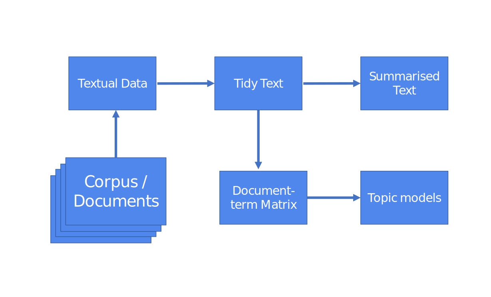
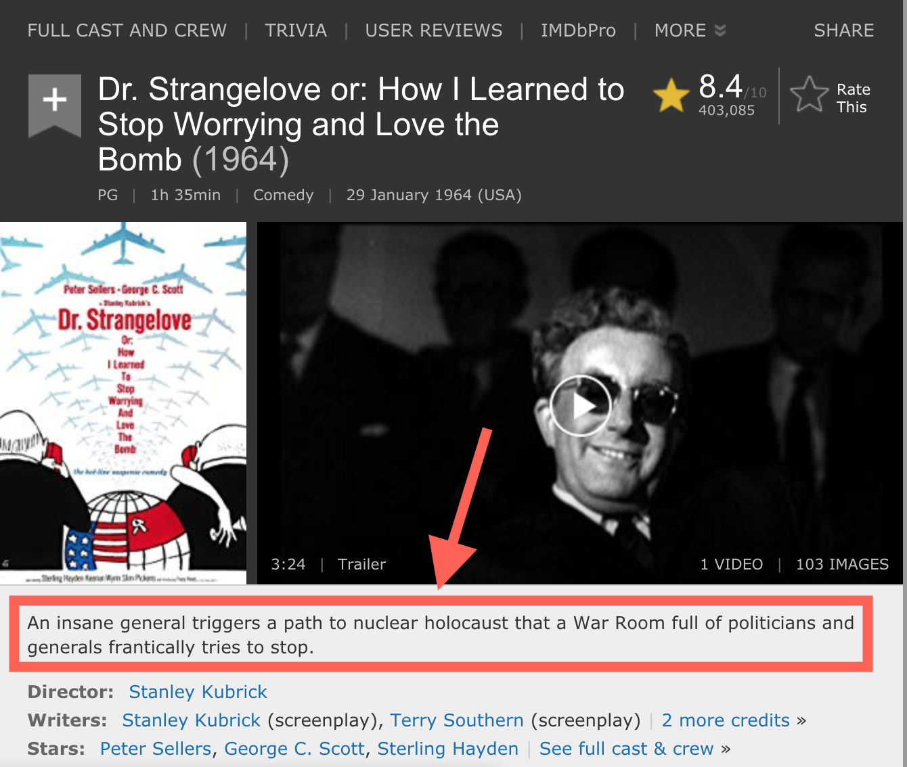

background-image: url(https://upload.wikimedia.org/wikipedia/en/6/6a/Logo_of_the_University_of_Sydney.svg)
background-size: 95%

<style>
pre {
  overflow-x: auto;
}
pre code {
  word-wrap: normal;
  white-space: pre;
}
</style>

```{r setup, include=FALSE}

options(htmltools.dir.version = FALSE)

knitr::opts_chunk$set(echo = TRUE, message = FALSE, warning = FALSE, 
                      dev = 'svg', 
                      fig.width = 6,
                      out.width="45%",
                      fig.align="center")

library(knitr)
library(kableExtra)
library(tidyverse)
library(sf)
library(DiagrammeR)
library(cowplot)
library(haven)

ggplot2::theme_set(theme_bw())

options(scipen = 100)

```

---

## Acknowledgement of Country

I would like to acknowledge the Traditional Owners of Australia and recognise their continuing connection to land, water and culture. The  University of Sydney is located on the land of the Gadigal people  of the Eora Nation. I pay my respects to their Elders, past and present.

---
# Text analysis in R: A Workflow

1. Import your data
2. Tidy your data
3. Model your data
4. Present your results

.center[]

---

class: center, inverse, middle

# Some basic tools...

---

## The stringr package (a package for string manipulation)

```{r}
library(stringr)

my_strings <- c(" a string ", " anonter string ", "and   another")

```

### Join multiple strings into one string

```{r}
stringr::str_c(my_strings, collapse = "~")
```

### Replace extra white spaces

```{r}
stringr::str_squish(my_strings)

```

---

## The stringr package (a package for string manipulation)

### Trim extra white spaces (at the start and end of the string)

```{r}
stringr::str_trim(my_strings) # this leaves inner extra spaces
```

### Find a string within a number o string

```{r}
corpus <- 
  c("One two three", "Four five six", "Seven eight nine")
```

```{r}
stringr::str_detect(corpus, 'five')
```

---

## The rvest package to get scrape web pages

> **scrape [with object]** copy (data) from a website using a computer program: *all search engines scrape content from sites without permission and display it on their own sites*.

The [rvest](https://rvest.tidyverse.org/) package facilitates downloading and manipulating HTML documents.

.center[</img>]

---

## The rvest package to get scrape web pages

A very basic HTML page:

```{html}
<!DOCTYPE html>
  <html>
    <body>
    <h1>My First Heading</h1>
    <div class='foo'><p>My first paragraph.</p></div>
    </body>
  </html>
```

HTML documents are defined by nested tags: `<html> <body> ... </body> </html>`.

Tags are used by web broswers (Chrome, Firefox, etc.) to position their content (e.g. the text `My First Heading`) onto the page. Tags are not visualised when the is rendered by a browser.

We can use tags to surgically extract information from a page as we are usually not interested in 99.99% of the content of a HTML document.


---

## The rvest package to get scrape web pages

A basic [rvest](https://rvest.tidyverse.org/) pipeline

```{r}
library(rvest)

# Start by reading a HTML page with read_html():
starwars <- rvest::read_html("https://rvest.tidyverse.org/articles/starwars.html")

# In this example we extract each HTML node (or tag) labelled "section"
films <- starwars %>% rvest::html_nodes("section")

films

```

---

## The tidytext package

A package to facilitate text mining using dplyr, ggplot2, and other tidy tools

```{r}
library(tidytext)

my_books <- 
  data.frame(book_id = c("one", 
                         "two"),
             book_text = c("Apple banana pear", 
                           "Kiwi mango tomato"))

my_books %>%
  tidytext::unnest_tokens(word, book_text, token = "words") #<<
```

---

## The tidytext package

The function `tidytext::unnest_tokens()` is the core function of the package. It "[s]plit a column (in the example before the column `book_text`) into **tokens**, flattening the table into one-token-per-row".

A **token** is the unit of analysis of choice for your text mining. It can be a `word` but also `sentences`, `lines`, `tweets`, or `ngrams` (so combination of 2, 3, 4+ words). 

```{r}
my_books %>%
  tidytext::unnest_tokens(ngram, book_text, 
                          token = "ngrams", n = 2)#<<
```


---

## sprintf()

sprintf() takes a string of text and injects other strings or numbers where you specify with the wildcard `%s`.

Let's take my string, a URL to access the Wikipedia API:

```{r}
my_url <- 
  "https://en.wikipedia.org/w/api.php?action=query&titles=%s&prop=info&inprop=url"
```

I want to reuse this URL to get information about a number of Wikipedia pages. In the query string I specify the page with `titles=[title of the page]`.

So to query for `Sydney` I can use `sprintf()` like this

```{r}
sprintf(my_url, "Sydney")
```

---

## for()

As every other computer language, R also allows for for-loop operations.

A for-loop will run a chunk of code multiple times. Here an example,

```{r}

for (i in c(1,2,3,4,5)) {
  print(i)
}

```

As expected, this outputs (thanks to the function `print()`) five times the content of the variable `i`. 

Yet the variable `i` (but you can use a different variable name) has a different value at each iteration of the loop. We specify this with `i in c(1,2,3,4,5)` (which for simplicity we can replace with `i in 1:5`).

---

class: inverse, middle, center

# Importing

---

# Importing

Let's first import some textual data into R from PDFs, webpages, XML documents and an API.

.center[</img>]

---

# Import PDF

```{r echo = F}
read_chunk("../doc/text-analysis-script/01-importing/import_pdf.R")
```

```{r import_pdf, eval = FALSE}

```

---

# Import HTML

## Xpath

> XPath can be used to navigate through elements and attributes in an XML[-like] document (see [www.w3schools.com/xml/xml_xpath.asp](https://www.w3schools.com/xml/xml_xpath.asp)).

```{html}
<!DOCTYPE html>
  <html>
    <body>
  
    <h1>My First Heading</h1>
  
    <div class='foo'><p>My first paragraph.</p></div>
  
    </body>
  </html>
```

The xpath `//div[@class='foo']/p` will get you this: `<p>My first paragraph.</p>`. (And you can check this [here](http://xpather.com/A4yx3Gsx))

---

# Import HTML

```{r echo = F}
read_chunk("../doc/text-analysis-script/01-importing/import_html.R", from = 1, to = 18)
```

```{r import_html1, eval = FALSE}

```

---

# Import HTML

```{r import_html2, eval = FALSE}

```

---

# Import HTML

```{r import_html3, eval = FALSE}

```

---

# Hands-on

Visit this page: [imdb.com/title/tt0057012/](https://imdb.com/title/tt0057012/) and try to parse this `summary_text` with XPath.

<div align = 'center'></div>

You will only need three functions: `read_html()`, `html_node()` and `html_text()` (and optionally `str_trim()`).

* Firefox: Right-click and *Inspect Element*
* Chrome: Right-click and *Inspect*
* Safari: 
  1. Enable "Show Developer Menu" in Safari's Preferences, *Advanced tab*.
  2. Right-click and *Inspect Element*

---

# Import XML

```{r echo = F}
read_chunk("../doc/text-analysis-script/01-importing/import_xml.R")
```

```{r import_xml1, eval = FALSE}

```

---

# Import XML

```{r import_xml2, eval = FALSE}

```

---

# APIs

An API (or **A**pplication **P**rogramming **I**nterface) makes it easier for a computer to communicate with another computer. Many public web APIs are available: they offer programmatic access to data resources of an enterprise. For example, the research on large Facebook and Twitter datasets is usually conducted on data collected after a request to the Facebook API (graph.facebook.com) and the Twitter API (api.twitter.com).

Wikipedia also has a [public API](http://en.wikipedia.org/w/api.php). And we can submit a request by concatenating different options in a single string (which you can actually enter into the address bar of your browser).

---

# APIs

```{r echo = FALSE}
api_tibble <- 
  tibble(parameter = c("http://en.wikipedia.org/w/api.php?",
                       "action=query",
                       "&format=json",
                       "&prop=revisions", 
                       "&rvprop=content",
                       "&rvsection=0",
                       "&titles=pizza"),
         description = c("Base URL",
                         "Which action to perform",
                         "The format of the output",
                         "Which properties to get for the queried pages",
                         "Which properties to get for each revision",
                         "Only retrieve the content of this section number",
                         "A list of titles to work on"))
knitr::kable(api_tibble, format = "html")
```

Ane let's concatenate everything together: 

http://en.wikipedia.org/w/api.php?action=query&format=json&prop=revisions&rvprop=content&rvsection=0&titles=pizza

---

# API import example (using a URL + jsonlite)

```{r echo = F}
read_chunk("../doc/text-analysis-script/01-importing/import_api.R")
```

```{r import_api1, eval = TRUE, message = FALSE, cache = TRUE}

```

---

# API import (using a package)

```{r import_api2, eval = FALSE}

```

---

class: inverse, middle, center

# Tidying


---

# Tidying (from PDF documents...)

```{r, echo=FALSE}
source("../doc/text-analysis-script/01-importing/import_pdf.R")
```

```{r, echo=FALSE}
read_chunk("../doc/text-analysis-script/02-tidying/tidy_df.R")
```

```{r tidy_df1}

```

---

# Tidying

```{r, echo=FALSE}
load('../data/text-analysis/rdata/g_books.RData')
```

```{r, echo=FALSE}
read_chunk("../doc/text-analysis-script/02-tidying/tidy_gutenberg_books.R")
```

```{r tidy_df2}

```


---

## Tidying

```{r tidy_df3}

```

---

## Tidying

```{r tidy_df4}

```

---

## Tidying

```{r tidy_df5}

```

---

## Summarising 

```{r tidy_df6}

```

---

## Summarising

```{r tidy_df7, fig.width=8, fig.height=5.5, fig.fullwidth=TRUE, dev='svg'}

```

---

## Summarising

```{r tidy_df8}

```

---

## Summarising

```{r tidy_df10, fig.width=8, fig.height=5.5, fig.fullwidth=TRUE, dev='svg'}

```

---
class: inverse, middle, center
# Document-term matrix

---

# Document-term matrix

The document-term matrix (dtm) is way to store information from a corpus where rows represent documents, columns tokens, while cells indicates the frequency of each token in the document. 
 
```{r}

data <- 
  tibble(text = c(  
    "pollution water environment jobs","healthcare doctors hospitals pollution",
    "smog environment water doctors","unemployment jobs wages immigration", 
    "hospitals drugs doctors visa","healthcare drugs doctors wages",
    "jobs wages unemployment healthcare","hospitals drugs doctors citizenship",
    "environment smog water economy", "foreigners immigration citizenship doctors",
    "immigration visa foreigners jobs", "economy wages jobs healthcare",
    "citizenship immigration foreigners drugs"),
    author = c("Sam", "Rosy", "Tom", "Alice", "Bob", "Carol", "Diana", 
               "Zach", "Yolie","Xavi", "Ahmad", "Ali", "Nemat")) 
dfm <- 
  data %>%
  tidytext::unnest_tokens(word, text) %>%
  dplyr::count(author, word, sort = TRUE) %>%
  tidytext::cast_dfm(author, word, n) #<<
```

---

# Document-term matrix

```{r, echo = FALSE}
kable(dfm[,1:8])
```

---
class: inverse, middle, center

# Topic models

---

# Topic models

> A **topic** is defined as a mixture over words where each word has a probability of belonging to a topic.

> A **document** is a mixture over topics, meaning that a single document can be composed of multiple topics. 

> As such, the sum of the topic proportions across all topics for a document is one, and the sum word probabilities for a given topic is one (Roberts, Stewart, & Tingley, forthcoming).

---

## Topic models: Prepare some data

```{r}
load('../data/text-analysis/rdata/g_books.RData')

reg <- regex("^chapter ", ignore_case = TRUE)
by_chapter <- g_books %>%
  dplyr::group_by(title) %>%
  dplyr::mutate(chapter = cumsum(str_detect(text, reg))) %>%
  dplyr::filter(chapter > 0) %>%
  dplyr::ungroup() %>%
  dplyr::group_by(gutenberg_id, title, chapter) %>%
  dplyr::summarize(text = paste(text, collapse = " ")) %>%
  tidyr::unite(title_chapter, title, chapter, sep = " # ")
```


## Topic models: Cast the document-term matrix (with `cast_dfm()`)

```{r}
tidy_books <- 
  by_chapter %>%
  dplyr::group_by(title_chapter) %>%
  tidytext::unnest_tokens(word, text) %>%
  dplyr::ungroup() %>%
  dplyr::mutate(word = str_extract(word, "[a-zA-Z]+")) %>%
  dplyr::anti_join(stop_words, by = 'word')
nrow(tidy_books)

books_dfm <- tidy_books %>%
  dplyr::count(title_chapter, word, sort = TRUE) %>%
  tidytext::cast_dfm(title_chapter, word, n)
```

---

## Let's topic model!

```{r cache = T}
library(stm)

# This will take a few seconds
model <- 
  stm::stm(books_dfm, K = 4, 
      verbose = FALSE, init.type = "Spectral")
```

We use the [stm](https://www.structuraltopicmodel.com/) (structural topic model) package

---

## Topic modelling: Show most significant words by topic

```{r echo = F}
library(stm)
```

```{r}
stm::labelTopics(model, 1:4)
```

---

## Topic modelling: Plot proportion by topic

```{r fig.}
plot(model, type = "summary")
```

---

## Topic modelling: Cloud for a topic

Word size depends on the importance of that word in the topic

```{r}

stm::cloud(model, topic = 1)

```

---

## Topic modelling: Beta identifies the importance of the topic-word pair

A relatively high beta indicates that the word is important in defying the topic.

You can use betas to help labelling the topic. (Yes, labelling is up to you!)

```{r}
tidy_topics_word_topic <-
  tidytext::tidy(model)

head(tidy_topics_word_topic)

```

---

## Topic modelling: Gamma identifies the importance of the topic-document pair

```{r}
tidy_topics_doc_topic <- 
  tidytext::tidy(model, matrix = "gamma",                    
                 document_names = rownames(books_dfm))

tidy_topics_doc_topic <-
  tidy_topics_doc_topic %>%
  tidyr::separate(document, c("title", "chapter"), 
                  sep = " # ", convert = TRUE)

head(tidy_topics_doc_topic)

```

---

```{r fig.width = 5, fig.height = 4, out.width = "60%"}

ggplot(tidy_topics_doc_topic,
       aes(y = gamma, x=factor(topic))) +
  geom_boxplot() + 
  facet_wrap(~title)

```

Documents are chapters not books. Still the topic modelling is effective in clustering by the corresponding book (of course, authors have different styles!).

---

## Finally, using t-SNE, a dimensionality reduction technique, to plot our chapters

```{r cache = T}
library(tsne)
tidy_topics_doc_topic$document <- 
  paste0(tidy_topics_doc_topic$title, " # ", tidy_topics_doc_topic$chapter)
spread_topics_doc_topic <-
  tidy_topics_doc_topic %>%
  tidyr::pivot_wider(id_cols = c("title", "chapter", "document"), 
                     names_from = topic,
                     values_from = gamma)

res <- tsne(spread_topics_doc_topic[,4:7], k=2)
spread_topics_doc_topic$x <- res[,1]
spread_topics_doc_topic$y <- res[,2]
```


---

## Finally, using t-SNE, a dimensionality reduction technique, to plot our chapters

```{r fig.width=6, fig.height=3.5, out.width='85%'}
ggplot(spread_topics_doc_topic, aes(x=x,y=y,colour=title)) +
  geom_point()
```

---


class: middle, inverse, center

# Wrapping up SSPS4102 

## Let's workshop A3 in the remaiming of the seminar!

---

## Very keen to receive your feedback on (if you have time)

#### Very keen to receive your feedback on:

* What you enjoyed / found useful in your learning

* Any constructive feedback as to areas that could have been improved

* Some specific areas you may wish to comment on:

    * Overall design of the course and coverage of topics
    * Assessment items
    * Pace and level of the class

---

## Wrapping up

* Thank you everyone for your participation and engagement in this course!

* Congratulations on making it through this far in the course and all the best with your degree!

* Stay in touch!

.center[]


